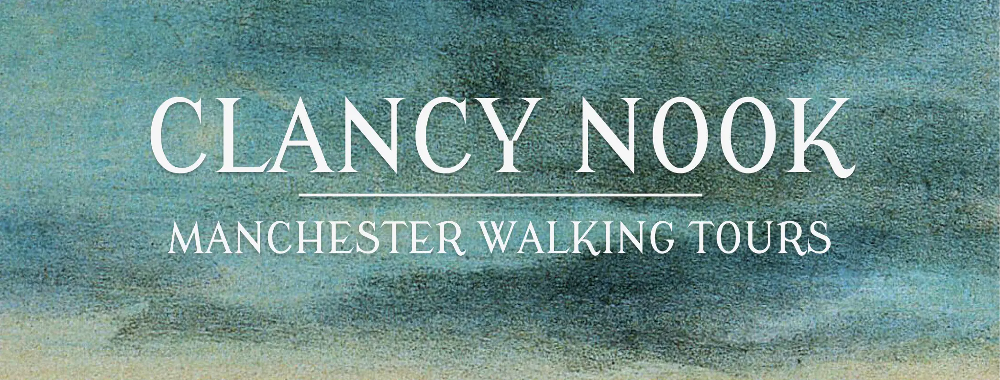
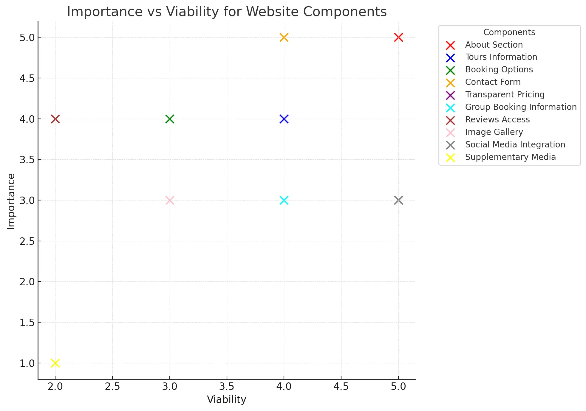

# **Clancy Nook | Walking Tours**
_Project Milestone 1_

## Contents

### 1. [Site Overview](#site-overview)
##### i. [Project Criteria](#project-criteria)
##### ii. [Web Developer Showcase](#web-developer-showcase)
##### iii. [Key Goals](#web-developer-showcase)
### 2. [Introduction](#introduction)
### 3. [User Experience (UX)](#user-experience-ux)
#### i. [Strategy](#strategy)
#### ii. [Scope](#scope)
#### iii. [Structure](#structure)
#### iv. [Skeleton](#skeleton)
#### v. [Surface](#surface)
### 4. [Features](#features)
### 5. [Technologies Used](#technologies-used)
### 6. [Testing](#testing)
### 7. [Deployment](#deployment)
### 8. [Acknowledgements](#acknowledgements)

## Site Overview 
This Website is a responsive, user-focused website designed for **Clancy Nook**, an experienced tour guide offering historic walking tours around Manchester. This project is developed as part of **Project Milestone 1** for the Code Institute's **Full Stack Web Development program**. The website aims to provide a central hub for tour information, booking, and reviews.

Visit the deployed site on github [here](https://teseolou.github.io/clancy-nook-walking-tours/index.html).

### Project Criteria
This project is designed to meet the following key requirements:
1. Create a **static front-end website** of at least 3 pages, or a single scrolling page divided into at least 3 distinct sections.
2. Incorporate **HTML5** and **CSS3** technologies to structure and style the site.
3. Include a **main navigation menu** for intuitive user experience and **responsive design** for different device sizes.
4. Use **semantic markup** and **accessible design principles** to ensure inclusivity.
5. Provide **clear, user-focused content** that fulfills both user and business goals.
6. Host the project on **GitHub Pages**, with version control via Git and complete documentation in a this README.md file.

### Web Developer Showcase
As a developer in training, this project aims to demonstrate:
1. Proficiency in HTML5 and CSS3 to create **structured and styled web pages**.
2. The ability to implement **responsive design principles**, ensuring the site adapts seamlessly to mobile, tablet, and desktop devices.
3. Skills in **accessibility-focused design**, following WCAG guidelines for color contrast, navigation, and semantic markup.
4. The capability to organize and manage a project using **Git version control** and clear commit messages.
5. The ability to write well-documented, maintainable code with an emphasis on **user experience (UX)** principles.
6. **Thorough testing and debugging processes** to ensure the site performs as intended across multiple devices, browsers, and screen sizes.
7. Use of **validation tools** (e.g., W3C HTML and CSS Validator) to confirm compliance with modern web standards.
8. Leveraging **performance analytics tools** such as Lighthouse to optimize the site's performance, accessibility, and adherence to best practices.

### Key Goals
The **Clancy Nook** project focuses on achieving the following:
1. Offer an intuitive, engaging platform for tourists, locals, corporate and community clients to learn about and book walking tours.
2. Showcase Clancy Nook's expertise and services offered.
3. Build a professional online presence for Clancy Nook.

## Introduction

## User Experience (UX)
User experience (UX) design focuses on creating meaningful, efficient, and enjoyable interactions between users and a product or service. For a website, this means designing a platform that meets users’ needs while providing an intuitive and visually appealing interface. 

Prioritising user experience is essential to ensuring that visitors can easily navigate the site, achieve their goals, and enjoy the process. This philosophy is particularly relevant to the Clancy Nook website, where the goal is to cater to a diverse audience of locals, tourists, and corporate clients.

### Strategy
The **Strategy Plane** in UX design forms the foundation of any project by aligning business goals with user needs. It addresses fundamental questions about what the website aims to achieve and how it delivers value to its users. 

For Clancy Nook, this meant not only creating an online presence but also ensuring the site serves as a seamless gateway for users to learn about, book, and engage with the historic walking tours offered. The strategy plane was the first port of call in the development process, as it established the overall purpose of the site and guided all subsequent design and development decisions.

By starting with the strategy, the project focused on identifying key objectives—such as enhancing visibility, streamlining booking processes, and showcasing the unique value of the tours—and balancing these with the needs of diverse user groups like tourists, locals, and corporate clients. This foundational step ensured that every feature and design element served a clear purpose, meeting both user expectations and business ambitions.

#### **Initial Discussion**
The development process for the Clancy Nook website began with an in-depth meeting with the client, Louis Cane. During this discussion, we explored key aspects of the business, including:
- The primary goals for the business and the website.
- Insights into Clancy Nook’s current operations, including its use of Linktree, TripAdvisor,  and Eventbrite.
- Current clientele and future clientele.
- Future Goals to expand the business by attracting more corporate clients and building partnerships with community organizations. 

#### **Business Goals**
The following business goals were established for the Clancy Nook website during the initial discussion phase. These goals emerged from a collaborative dialogue with the client, focusing on both immediate needs and aspirations for the future. While some goals centered on creating a strong digital presence and improving user experience, others reflected long-term ambitions, such as attracting corporate clients and collaborating with local communities.

Each business goal is paired with a corresponding call-to-action (CTA) designed to:
- Guide users toward desired actions such as booking a tour, learning more about the guide, or contacting for corporate inquiries.
- Make the website's purpose immediately clear to visitors.

1. **Establish Online Presence**  
Create a professional and user-friendly website to build credibility for Clancy Nook as a premier provider of historic walking tours in Manchester.  
**Call-to-Action:** _"Discover Clancy Nook and explore Manchester's rich history with our guided walking tours. Visit my website to learn more and join our community of history enthusiasts."_

2. **Simplify Booking**  
Integrate seamless links to Eventbrite for easy tour booking while showcasing a personalized contact option for inquiries.  
**Call-to-Action:** _"Book your spot on a Clancy Nook walking tour today through our seamless Eventbrite integration or contact me directly for inquiries."_

3. **Showcase Unique Value**  
Highlight Louis Cane's deep knowledge of Manchester's history and the engaging storytelling that sets Clancy Nook apart from other tours.  
**Call-to-Action:** _"Experience Manchester’s history like never before with Clancy Nook, your expert guide and storyteller."_

4. **Provide a Central Hub for Tour Information**  
Serve as a central resource for tour details, showcasing engaging images, insightful descriptions, and glowing testimonials to entice potential customers.  
**Call-to-Action:** _"Find all the details you need in one place—tour schedules, meeting points, and review - all at your fingertips."_

5. **Encourage Repeat Customers**  
Build customer loyalty by offering exclusive updates on new tours or events through an optional newsletter signup.  
**Call-to-Action:** _"Stay in the loop! Follow us on social media for updates on new tours and exclusive events."_

6. **Attract Corporate Clients** (Future Goal)  
Expand Clancy Nook's reach to the corporate world by showcasing tailored private tours for businesses, including team-building events, company outings, and cultural excursions.  
**Call-to-Action:** _"Looking for a unique team-building experience? Contact me to arrange private walking tours."_

7. **Facilitate Opportunities to Work with Communities** (Future Goal)  
Foster connections with local communities by offering concession rates or free tours for underserved groups, contributing to the city’s cultural inclusivity.  
**Call-to-Action:** _"Partner with Clancy Nook to make history accessible to all. Reach out for details about our community-focused tour initiatives."_

Goals 6 and 7, while not central to the website's initial development, represent aspirational objectives for the business’s growth and social impact. By planting the seeds for these initiatives now, the site can evolve over time to accommodate these long-term ambitions.

#### **User Demographics**
Understanding attends and books Clancy Nook tours establishes clear user demographics, which permitted the identification of key user groups, their needs, and their motivations. These in turn informed the development of tailored user stories and features for the website. By analysing the clientele and tour attendance patterns, we could align the website's functionality and content with the expectations of the target audience. This ensured that every feature and piece of information on the site would resonate with its users and provide maximum value.

The demographics were broken down by tour type to account for the unique audience profiles each tour attracts:
- **City Center Tour:**
  - **60-70% Mancunians:** Local history enthusiasts seeking to deepen their understanding of the city.
  - **20-30% Tourists or Visitors:** Out-of-town guests looking to explore Manchester's cultural and historical highlights.
  - **Diverse Audience Mix:** Includes families, students, and older adults.

- **Whalley Range Tour:**
  - **Majority Local Residents:** Individuals with a vested interest in the area's history or personal connections.
  - **New Residents:** Those wanting to learn about the neighborhood they now call home.
  - **Former Residents:** Occasional attendees revisiting for nostalgic reasons.

- **Ancoats Tour:**
  - **80-90% from the Wider Manchester Region:** Predominantly history enthusiasts who appreciate the industrial heritage of Ancoats.
  - **Currently Lacking Local Attendance:** Attracting Ancoats locals remains a growth area and a goal for the tour guide.

#### **Target Audiences**

The insights gathered from the demographic analysis and business goals allowed us to define the following target audiences for the Clancy Nook website. Each audience group aligns with specific business goals, helping to establish clear connections between user needs and the website's features.

1. **New Users - Prospective Customers:**  
   First-time visitors exploring Clancy Nook and seeking information about tours to decide on booking.

2. **Returning Users:**  
   Loyal customers looking for updates, new tours, and opportunities to engage further.

3. **Locals:**  
   Residents of Manchester or surrounding areas interested in deepening their connection to the city’s history.

4. **Tourists:**  
   Visitors to Manchester who want to learn about its cultural and historical highlights in an engaging way.

5. **Corporate Users (Businesses) - Prospective Customers:**  
   Businesses interested in private tours for team-building events, company outings, or corporate retreats.

6. **Community Leaders (Non-profits/Schools) - Prospective Customers:**  
   Organizations looking to collaborate with Clancy Nook for concession-priced or free educational tours tailored to their needs.

#### **User Stories** 
For this project, user stories developed capture the diverse needs of Clancy Nook’s target audience, ensuring the website provides a user-centric experience. The creation of user stories helped define what different user groups—such as locals, tourists, corporate clients, and returning users—expect from the website. These stories bridge the gap between user needs and the technical development process, ensuring every feature contributes to a positive user experience and serve as a roadmap for development and guiding design decisions. 
 
To ensure effective and timely delivery, the user stories were divided into three priority categories: **must-have**, **should-have**, and **could-have**. These categories reflect the essential, important, and desirable features for the website.

- **Must-Have** stories represent the core functionalities that the website cannot succeed without. These include fundamental aspects like clear navigation, booking instructions, contact form and reviews.  
- **Should-Have** stories include features that enhance the user experience and cater to specific user groups, such as social media links and private tour information.  
- **Could-Have** stories consist of advanced or supplementary features that, while not essential, would add extra value if implemented, such as downloadable brochures or storytelling audio clips.  

This prioritization ensures that critical features are developed first while leaving room for additional improvements based on time and resources.

Must-Have
- As a **tourist**, I want the website to be easy to navigate, allowing me to quickly find tour information.  
- As a **local**, I want to read about the guide’s expertise and background so that I can appreciate the depth of historical knowledge offered.  
- As a **new user**, I want clear instructions on how to book tours so that I can easily reserve my spot on a Clancy Nook tour.  
- As a **new user**, I want to learn about the tours’ themes and details so that I can decide which tour to book.  
- As a **local**, I want to see reviews from other attendees so that I can feel confident about the tour’s quality.  
- As a **returning user**, I want to be able to write a review so I can encourage others to book a tour.
- As a **returning user**, I want to be able to contact the tour guide so I can ask about upcoming tours.
- As a **returning user**, I want to find other available tours so that I can book a different tour.
- As a **local**, I want to easily contact the tour guide so that I can ask about specific tour routes.
- As a **new user**, I want to know how to contact the tour guide so I can ask questions about the services they offer.
- As a **tourist**, I want to easily contact the tour guide so that I can ask which tour would be most suitable for me.

Should-Have
- As a **corporate user**, I want to find information about private tours for businesses so that I can book a group experience.  
- As a **returning user**, I want to find social media links in the footer so that I can follow updates and share my experience.  
- As a **new user**, I want to view a gallery of images from past tours so that I can get a sense of the experience.  
- As a **tourist**, I want to access clear meeting point details so that I can find the starting location easily.  
- As a **business owner**, I want to easily contact the tour guide so that I can ask about availability for private tours.  
- As a **community leader**, I would like to be able to contact the tour guide so I can ask them about community concession rates.

Could-Have
- As a **corporate user**, I want downloadable PDFs or brochures about corporate tours so that I can easily share them with my team.  
- As a **tourist**, I want media clips or snippets of the guide’s storytelling so that I can preview the experience before booking.  

By creating and prioritizing these user stories, the website ensures a structured, user-focused development process that delivers meaningful value to both users and the business.

#### **Emerging Website Components**
The analysis of user needs and expectations highlighted several critical components that would form the foundation of the Clancy Nook website. These components were designed to address the goals of both the business and its diverse user base, ensuring a user-friendly, informative, and engaging experience. Below are the core website components that emerged during the planning phase:
1. **About Section**  
   Including information about the guide’s historical knowledge and storytelling abilities emphasizes the unique value Clancy Nook offers, particularly appealing to locals and history enthusiasts.

2. **Tours Information**  
   Providing clear and accessible details about available tours, including themes, schedules, meeting points, and additional details, was identified as a top priority. This ensures users can quickly learn about the experiences offered.

3. **Booking Options**  
   A streamlined booking process via integrated links to Eventbrite, combined with a user-friendly contact form for bespoke inquiries, makes securing a spot on a tour simple and efficient.

4. **Contact Form**  
   A dedicated contact section provides users with an easy way to reach out for questions, inquiries about bespoke tours, or to request additional information, ensuring seamless communication.

5. **Transparent Pricing**  
   Highlighting pricing information, including the pay-what-you-can option, ensures users understand the cost of the tours. This transparency encourages bookings while showcasing Clancy Nook's accessibility for a wider audience.

6. **Group Booking Section**  
   Dedicated sections for corporate users and community leaders provide tailored information about private and group tours. This includes details on how these tours can be customized to meet specific needs, reinforcing the business’s appeal to a broader audience.

7. **Reviews Access**  
   Featuring testimonials and reviews from past attendees helps build credibility and trust, particularly for new users and locals seeking assurance of tour quality.

8. **Image Gallery**  
   A gallery showcasing images from past tours provides a visual representation of the experiences offered. This component is designed to engage tourists and returning users, giving them a sense of the atmosphere and storytelling that Clancy Nook tours provide.

9. **Social Media Integration**  
   Social media links in the footer encourage users to stay connected with Clancy Nook, providing updates and opportunities to share their experiences. This fosters community engagement and increases the visibility of the tours.

10. **Supplementary Media**  
    Supplementary resources, such as downloadable PDFs or brochures for corporate and private tours, provide businesses with shareable materials to aid in internal planning. Additionally, audio or video snippets of the guide’s storytelling offer a unique preview of the experience for prospective customers, enticing them to book a tour.

#### **Importance/Feasibility**
The Importance/Feasibility analysis evaluates each website component based on two criteria: importance and feasibility. Importance refers to how critical the component is to achieving the business goals and addressing user needs outlined in the user stories. Feasibility, on the other hand, assesses the practicality of implementing the component within the project's constraints (e.g., timeline, resources, and technical expertise).

This analysis ensures that the development process prioritizes components that deliver the most value while remaining achievable. By striking this balance, the project remains focused and efficient, delivering the maximum possible impact within its constraints.

The table below rates each component on a scale of 1 to 5 for both importance and feasibility:
- **Importance:** A rating of **1** means the component has low relevance to business goals or user stories, while a **5** signifies that the component is essential.
- **Feasibility:** A rating of **1** indicates that the component is difficult to implement within the project's constraints, while a **5** means it is straightforward to achieve.

| **Component** | **Importance** | **Feasibility** |
| ------------- | -------------- | --------------- |
| About Section | 5 | 5 |
| Tours Information | 4 | 4 |
| Booking Options | 4 | 3 |
| Contact Form | 5 | 4 |
| Transparent Pricing | 3 | 5 |
| Group Booking Information | 3 | 4 |
| Reviews Access | 4 | 2 |
| Image Gallery | 3 | 3 |
| Social Media Integration | 3 | 5 |
| Supplementary Media | 1 | 2 |

The graph below illustrates the relationship between importance and feasibility for each component. Components plotted closer to the top-right corner are both high in importance and feasible, making them top priorities for the project. Components in other quadrants help identify where compromises or adjustments may be needed.

Graph Insights:
- **High Importance & High Feasibility**: Components such as the **About Section**, **Contact Form**, **Tours Information**, and **Transparent Pricing** appear in this quadrant, making them the highest priority for the website. These are the backbone of the user experience and directly align with Clancy Nook’s primary goals of establishing credibility, simplifying bookings, and providing clear information.
  
- **High Importance & Moderate Feasibility**: Features like **Booking Options**, **Group Booking Information**, and **Reviews Access** are essential but require careful implementation. For example, while **Reviews Access** is crucial for building trust and encouraging bookings, the additional design and structural requirements make it slightly more complex to integrate. Nonetheless, it is still a key feature to include, especially as it directly supports the site's credibility and aligns with user needs for confidence in the service.
  
- **Moderate Importance & High Feasibility**: **Social Media Integration** stands out as a low-effort, high-reward feature. Adding social media icons in the footer enhances user engagement and encourages sharing without significantly increasing development complexity.

- **Low Importance & Low Feasibility**: Features like **Supplementary Media**, including brochures and audio snippets, rank lower in priority. While they could enhance the user experience, they are considered optional for the project's minimal viable product (MVP).

#### **Project Planning**
This analysis directly informs project planning by providing a clear roadmap for prioritizing features during development. Using the _GitHub Projects Board_ [here](https://github.com/users/TeseoLou/projects/3/views/2), I can allocate tasks based on importance and feasibility, ensuring high-priority components are delivered first. This approach aligns with the concept of a **Minimal Viable Product (MVP)**.

The **Scope Plane** in UX design also comes into play here, ensuring that the identified components fit within the project's constraints while still delivering a meaningful experience. By focusing on features in the high-importance/high-feasibility quadrant and working down, the project remains achievable without sacrificing value.

