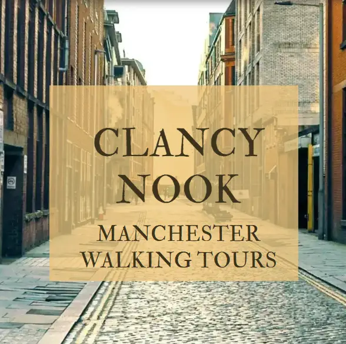
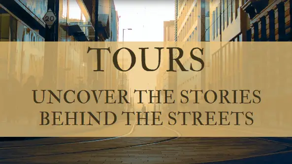
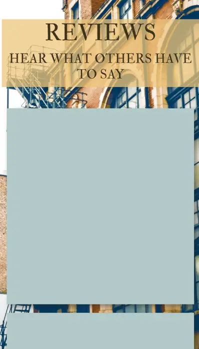
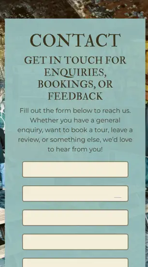
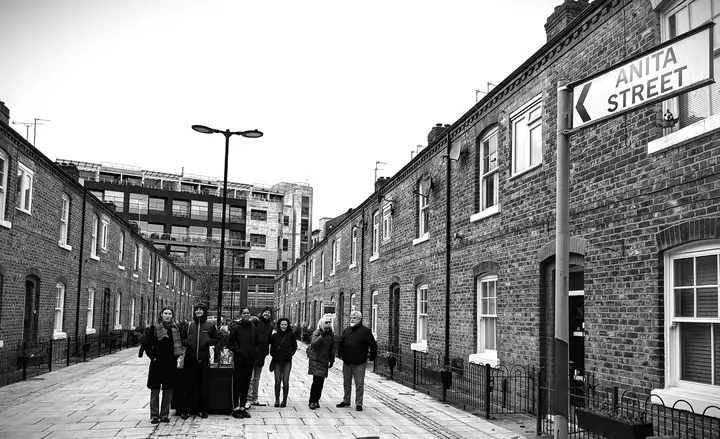
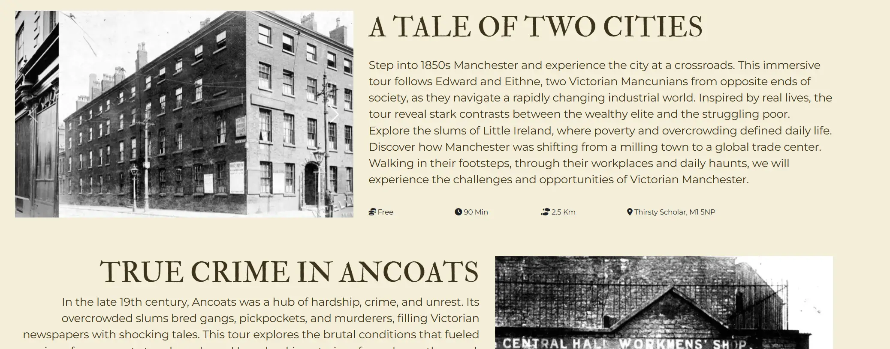
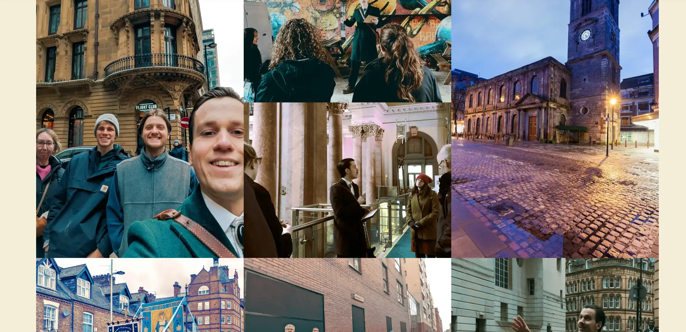
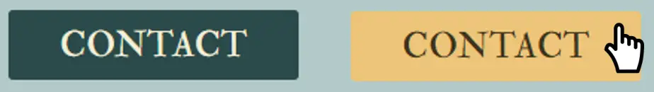
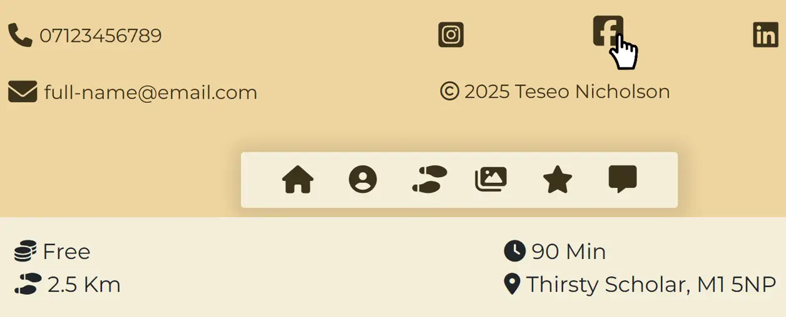
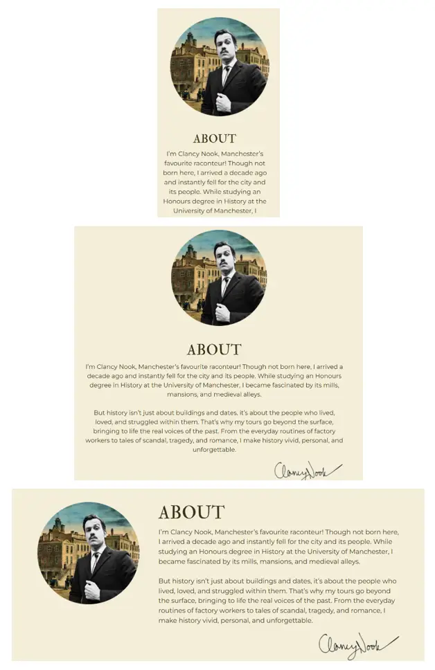

# **Clancy Nook | Walking Tours**
_Project Milestone 1_

   

# **Contents**

### 1. [Site Overview](#site-overview-1)
##### 1.1. [Project Criteria](#project-criteria-11)
##### 1.2. [Web Developer Showcase](#web-developer-showcase-12)
##### 1.3. [Key Goals](#web-developer-showcase-13)
### 2. [User Experience (UX)](#user-experience-ux)
#### 2.1. [Strategy](#strategy-21)
#### 2.2. [Scope](#scope-22)
#### 2.3. [Structure](#structure-23)
#### 2.4. [Skeleton](#skeleton-24)
#### 2.5. [Surface](#surface-25)
### 3. [Process Methodology](#process-methodology-3)
#### 3.1. [Approach](#approach-31)
#### 3.2. [Initial Setup](#initial-setup-32)
#### 3.3. [Page Template](#page-template-33)
#### 3.4. [Workflow](#workflow-34)
### 4. [Features](#features-4)
#### 4.1. [Core Features](#core-features-41)
#### 4.2. [Specific Features](#specific-features-42)
#### 4.3 [Other Features](#other-features-43)
#### 5. [Bugs](#bugs-5)
### 6. [Testing](#testing-6)
### 7. [Deployment](#deployment-7)
### 8 [Technologies Used](#technologies-used-8)
### 9. [Acknowledgements](#acknowledgements-9)

---

# **Site Overview** (1)
This Website is a responsive, user-focused website designed for **Clancy Nook**, an experienced tour guide offering historic walking tours around Manchester. This project is developed as part of **Project Milestone 1** for the Code Institute's **Full Stack Web Development program**. The website aims to provide a central hub for tour information, booking, and reviews.

Visit the deployed site on GitHub [here](https://teseolou.github.io/clancy-nook-walking-tours/index.html).

## **Project Criteria** (1.2)
This project is designed to meet the following key requirements:
1. Create a **static front-end website** of at least 3 pages, or a single scrolling page divided into at least 3 distinct sections.
2. Incorporate **HTML5** and **CSS3** technologies to structure and style the site.
3. Include a **main navigation menu** for intuitive user experience and **responsive design** for different device sizes.
4. Use **semantic markup** and **accessible design principles** to ensure inclusivity.
5. Provide **clear, user-focused content** that fulfils both user and business goals.
6. Host the project on **GitHub Pages**, with version control via Git and complete documentation in a this README.md file.

## **Web Developer Showcase** (1.3)
As a developer in training, this project aims to demonstrate:
1. Proficiency in HTML5 and CSS3 to create **structured and styled web pages**.
2. The ability to implement **responsive design principles**, ensuring the site adapts seamlessly to mobile, tablet, and desktop devices.
3. Skills in **accessibility-focused design**, following WCAG guidelines for color contrast, navigation, and semantic markup.
4. The capability to organise and manage a project using **Git version control** and clear commit messages.
5. The ability to write well-documented, maintainable code with an emphasis on **user experience (UX)** principles.
6. **Thorough testing and debugging processes** to ensure the site performs as intended across multiple devices, browsers, and screen sizes.
7. Use of **validation tools** (e.g., W3C HTML and CSS Validator) to confirm compliance with modern web standards.
8. Implement **performance analytics tools** such as Lighthouse to optimise the site's performance, accessibility, and adherence to best practices.

## **Key Goals** (1.4)
The **Clancy Nook** project focuses on achieving the following:
1. Offer an intuitive, engaging platform for tourists, locals, corporate and community clients to learn about and book walking tours.
2. Showcase Clancy Nook's expertise and services offered.
3. Build a professional online presence for Clancy Nook.

---

# **User Experience** (2)
User experience (UX) design focuses on creating meaningful, efficient, and enjoyable interactions between users and a product or service. For a website, this means designing a platform that meets users’ needs while providing an intuitive and visually appealing interface. 

Prioritising user experience is essential to ensuring that visitors can easily navigate the site, achieve their goals, and enjoy the process. This is particularly relevant to the Clancy Nook website, where the goal was to cater to a diverse audience of locals, tourists, and corporate clients.

## **Strategy** (2.1)
The **Strategy Plane** in UX design formed the foundation of the project by aligning business goals with user needs. It addressed fundamental questions about what the website aimed to achieve and how it delivered value to its users.

For Clancy Nook, this meant not only creating an online presence but also ensuring the site served as a seamless gateway for users to learn about, book, and engage with the historic walking tours offered. The strategy plane was the first port of call in the development process, as it established the overall purpose of the site and guided all subsequent design and development decisions.

### **Initial Discussion**

The development process for the Clancy Nook website began with an in-depth meeting with the client, Louis Cane. During this discussion, we explored key aspects of the business, including:

- The primary goals for the business and the website.
- Insights into Clancy Nook’s past operations, including its use of Linktree, TripAdvisor, and Eventbrite.
- Previous clientele and anticipated future clientele.
- Future goals to expand the business by attracting more corporate clients and building partnerships with community organizations. 

### **Business Goals**

The following business goals were established for the Clancy Nook website during the initial discussion phase. These goals emerged from a collaborative dialogue with the client, focusing on both immediate needs and aspirations for the future. While some goals centered on creating a strong digital presence and improving user experience, others reflected long-term ambitions, such as attracting corporate clients and collaborating with local communities.

Each business goal was paired with a corresponding call-to-action (CTA) designed to:

- Guide users toward desired actions such as booking a tour, learning more about the guide, or contacting for corporate inquiries.
- Make the website's purpose immediately clear to visitors.

1. Establish Online Presence  
   Created a professional and user-friendly website to build credibility for Clancy Nook as a premier provider of historic walking tours in Manchester.  
   *Call-to-Action:* _"Discover Clancy Nook and explore Manchester's rich history with our guided walking tours. Visit my website to learn more and join our community of history enthusiasts."_

2. Simplify Booking  
   Integrated seamless links to Eventbrite for easy tour booking while showcasing a personalized contact option for inquiries.  
   *Call-to-Action:* _"Book your spot on a Clancy Nook walking tour today through our seamless Eventbrite integration or contact me directly for inquiries."_

3. Showcase Unique Value  
   Highlighted Louis Cane's deep knowledge of Manchester's history and the engaging storytelling that set Clancy Nook apart from other tours.  
   *Call-to-Action:* _"Experience Manchester’s history like never before with Clancy Nook, your expert guide and storyteller."_

4. Provide a Central Hub for Tour Information  
   Served as a central resource for tour details, showcasing engaging images, insightful descriptions, and glowing testimonials to entice potential customers.  
   *Call-to-Action:* _"Find all the details you need in one place—tour schedules, meeting points, and reviews—all at your fingertips."_

5. Encourage Repeat Customers  
   Built customer loyalty by offering exclusive updates on new tours or events through an optional newsletter signup.  
   *Call-to-Action:* _"Stay in the loop! Follow us on social media for updates on new tours and exclusive events."_

6. Attract Corporate Clients (Future Goal)  
   Expanded Clancy Nook's reach to the corporate world by showcasing tailored private tours for businesses, including team-building events, company outings, and cultural excursions.  
   *Call-to-Action:* _"Looking for a unique team-building experience? Contact me to arrange private walking tours."_

7. Facilitate Opportunities to Work with Communities (Future Goal)  
   Fostered connections with local communities by offering concession rates or free tours for underserved groups, contributing to the city’s cultural inclusivity.  
   *Call-to-Action:* _"Partner with Clancy Nook to make history accessible to all. Reach out for details about our community-focused tour initiatives."_

Goals 6 and 7, while not central to the website's initial development, represented aspirational objectives for the business’s growth and social impact. By planting the seeds for these initiatives early on, the site could evolve over time to accommodate these long-term ambitions.

### **User Demographics ** 

Understanding who attended and booked Clancy Nook tours helped establish clear user demographics. This process allowed for the identification of key user groups, their needs, and their motivations. These insights informed the development of tailored user stories and features for the website. By analyzing the clientele and tour attendance patterns, we aligned the website's functionality and content with the expectations of the target audience. This ensured that every feature and piece of information on the site resonated with its users and provided maximum value.

The demographics were broken down by tour type to account for the unique audience profiles each tour attracted:

- **City Center Tour:**  
  - 60-70% Mancunians: Local history enthusiasts seeking to deepen their understanding of the city.  
  - 20-30% Tourists or Visitors: Out-of-town guests looking to explore Manchester's cultural and historical highlights.  
  - Diverse audience mix, including families, students, and older adults.

- **Whalley Range Tour:**  
  - Majority local residents: Individuals with a vested interest in the area's history or personal connections.  
  - New residents: Those wanting to learn about the neighborhood they now call home.  
  - Former residents: Occasional attendees revisiting for nostalgic reasons.

- **Ancoats Tour:**  
  - 80-90% from the wider Manchester region: Predominantly history enthusiasts who appreciated the industrial heritage of Ancoats.  
  - Currently lacking local attendance: Attracting Ancoats locals remained a growth area and a goal for the tour guide.

### **Target Audiences**  

The insights gathered from the demographic analysis and business goals allowed us to define the following target audiences for the Clancy Nook website. Each audience group aligned with specific business goals, helping to establish clear connections between user needs and the website's features.

1. New Users - Prospective Customers  
   First-time visitors exploring Clancy Nook and seeking information about tours to decide on booking.

2. Returning Users  
   Loyal customers looking for updates, new tours, and opportunities to engage further.

3. Locals  
   Residents of Manchester or surrounding areas interested in deepening their connection to the city’s history.

4. Tourists  
   Visitors to Manchester who wanted to learn about its cultural and historical highlights in an engaging way.

5. Corporate Users (Businesses) - Prospective Customers  
   Businesses interested in private tours for team-building events, company outings, or corporate retreats.

6. Community Leaders (Non-profits/Schools) - Prospective Customers  
   Organizations looking to collaborate with Clancy Nook for concession-priced or free educational tours tailored to their needs.

### **User Stories**  

For this project, user stories were developed to capture the diverse needs of Clancy Nook’s target audience, ensuring the website provided a user-centric experience. The creation of user stories helped define what different user groups—such as locals, tourists, corporate clients, and returning users—expected from the website. These stories bridged the gap between user needs and the technical development process, ensuring every feature contributed to a positive user experience and served as a roadmap for development and design decisions.  

To ensure effective and timely delivery, the user stories were divided into three priority categories: must-have, should-have, and could-have. These categories reflected the essential, important, and desirable features for the website.

- **Must-Have** stories represented the core functionalities that the website could not succeed without. These included fundamental aspects like clear navigation, booking instructions, a contact form, and reviews.  
- **Should-Have** stories included features that enhanced the user experience and catered to specific user groups, such as social media links and private tour information.  
- **Could-Have** stories consisted of advanced or supplementary features that, while not essential, would add extra value if implemented, such as downloadable brochures or storytelling audio clips.  

This prioritization ensured critical features were developed first while leaving room for additional improvements based on time and resources.

Must-Have
>_As a **tourist**, I want the website to be easy to navigate, allowing me to quickly find tour information._  
>_As a **local**, I want to read about the guide’s expertise and background so that I can appreciate the depth of historical knowledge offered._  
>_As a **new user**, I want clear instructions on how to book tours so that I can easily reserve my spot on a Clancy Nook tour._ 
>_As a **new user**, I want to learn about the tours’ themes and details so that I can decide which tour to book._  
>_As a **local**, I want to see reviews from other attendees so that I can feel confident about the tour’s quality._  
>_As a **returning user**, I want to be able to write a review so I can encourage others to book a tour._
>_As a **returning user**, I want to be able to contact the tour guide so I can ask about upcoming tours._  
>_As a **returning user**, I want to find other available tours so that I can book a different tour._  
>_As a **local**, I want to easily contact the tour guide so that I can ask about specific tour routes._  
>_As a **new user**, I want to know how to contact the tour guide so I can ask questions about the services they offer._  
>_As a **tourist**, I want to easily contact the tour guide so that I can ask which tour would be most suitable for me._  

Should-Have
>_As a **corporate user**, I want to find information about private tours for businesses so that I can book a group experience._  
>_As a **returning user**, I want to find social media links in the footer so that I can follow updates and share my experience._  
>_As a **new user**, I want to view a gallery of images from past tours so that I can get a sense of the experience._  
>_As a **tourist**, I want to access clear meeting point details so that I can find the starting location easily._  
>_As a **business owner**, I want to easily contact the tour guide so that I can ask about availability for private tours._  
>_As a **community leader**, I would like to be able to contact the tour guide so I can ask them about community concession rates._

Could-Have
>_As a **corporate user**, I want downloadable PDFs or brochures about corporate tours so that I can easily share them with my team._  
>_As a **tourist**, I want media clips or snippets of the guide’s storytelling so that I can preview the experience before booking._  

By creating and prioritizing these user stories, the website ensured a structured, user-focused development process that delivered meaningful value to both users and the business.

### **Emerging Website Components**

The analysis of user needs and expectations highlighted several critical components that formed the foundation of the Clancy Nook website. These components were designed to address the goals of both the business and its diverse user base, ensuring a user-friendly, informative, and engaging experience. Below are the core website components that emerged during the planning phase:

1. About Section  
   Including information about the guide’s historical knowledge and storytelling abilities emphasized the unique value Clancy Nook offered, particularly appealing to locals and history enthusiasts.

2. Tours Information  
   Providing clear and accessible details about available tours, including themes, schedules, meeting points, and additional details, was identified as a top priority. This ensured users could quickly learn about the experiences offered.

3. Booking Options  
   A streamlined booking process via integrated links to Eventbrite, combined with a user-friendly contact form for bespoke inquiries, made securing a spot on a tour simple and efficient.

4. Contact Form  
   A dedicated contact section provided users with an easy way to reach out for questions, inquiries about bespoke tours, or to request additional information, ensuring seamless communication.

5. Transparent Pricing  
   Highlighting pricing information, including the pay-what-you-can option, ensured users understood the cost of the tours. This transparency encouraged bookings while showcasing Clancy Nook's accessibility for a wider audience.

6. Group Booking Section  
   Dedicated sections for corporate users and community leaders provided tailored information about private and group tours. This included details on how these tours could be customized to meet specific needs, reinforcing the business’s appeal to a broader audience.

7. Reviews Access  
   Featuring testimonials and reviews from past attendees helped build credibility and trust, particularly for new users and locals seeking assurance of tour quality.

8. Image Gallery  
   A gallery showcasing images from past tours provided a visual representation of the experiences offered. This component was designed to engage tourists and returning users, giving them a sense of the atmosphere and storytelling that Clancy Nook tours provided.

9. Social Media Integration  
   Social media links in the footer encouraged users to stay connected with Clancy Nook, providing updates and opportunities to share their experiences. This fostered community engagement and increased the visibility of the tours.

10. Supplementary Media  
    Supplementary resources, such as downloadable PDFs or brochures for corporate and private tours, provided businesses with shareable materials to aid in internal planning. Additionally, audio or video snippets of the guide’s storytelling offered a unique preview of the experience for prospective customers, enticing them to book a tour.

### **Importance/Feasibility**

The Importance/Feasibility analysis evaluated each website component based on two criteria: importance and feasibility. Importance referred to how critical the component was to achieving the business goals and addressing user needs outlined in the user stories. Feasibility, on the other hand, assessed the practicality of implementing the component within the project's constraints (e.g., timeline, resources, and technical expertise).

This analysis ensured that the development process prioritized components that delivered the most value while remaining achievable. By striking this balance, the project remained focused and efficient, delivering the maximum possible impact within its constraints.

The table below rated each component on a scale of 1 to 5 for both importance and feasibility:

- **Importance:** A rating of 1 meant the component had low relevance to business goals or user stories, while a 5 signified that the component was essential.
- **Feasibility:** A rating of 1 indicated that the component was difficult to implement within the project's constraints, while a 5 meant it was straightforward to achieve.

| **Component**             | **Importance** | **Feasibility** |
| ------------------------- | -------------- | --------------- |
| About Section             | 5              | 5               |
| Tours Information         | 4              | 4               |
| Booking Options           | 4              | 3               |
| Contact Form              | 5              | 4               |
| Transparent Pricing       | 3              | 5               |
| Group Booking Information | 3              | 4               |
| Reviews Access            | 4              | 2               |
| Image Gallery             | 3              | 3               |
| Social Media Integration  | 3              | 5               |
| Supplementary Media       | 1              | 2               |

The graph below illustrates the relationship between importance and feasibility for each component. Components plotted closer to the top-right corner are both high in importance and feasible, making them top priorities for the project. Components in other quadrants help identify where compromises or adjustments may be needed.

   

Graph Insights:
- **High Importance & High Feasibility**: Components such as the **About Section**, **Contact Form**, **Tours Information**, and **Transparent Pricing** appear in this quadrant, making them the highest priority for the website. These are the backbone of the user experience and directly align with Clancy Nook’s primary goals of establishing credibility, simplifying bookings, and providing clear information.
  
- **High Importance & Moderate Feasibility**: Features like **Booking Options**, **Group Booking Information**, and **Reviews Access** are essential but require careful implementation. For example, while **Reviews Access** is crucial for building trust and encouraging bookings, the additional design and structural requirements make it slightly more complex to integrate. Nonetheless, it is still a key feature to include, especially as it directly supports the site's credibility and aligns with user needs for confidence in the service.
  
- **Moderate Importance & High Feasibility**: **Social Media Integration** stands out as a low-effort, high-reward feature. Adding social media icons in the footer enhances user engagement and encourages sharing without significantly increasing development complexity.

- **Low Importance & Low Feasibility**: Features like **Supplementary Media**, including brochures and audio snippets, rank lower in priority. While they could enhance the user experience, they are considered optional for the project's minimal viable product (MVP).

---

## Scope (2.2)

The Scope Plane in UX design addressed the functional and content requirements necessary to fulfill the strategic objectives outlined in the Strategy Plane. While the Strategy Plane defined _why_ the project existed and _who_ it served, the Scope Plane determined _what_ the website needed to achieve those goals.

For the Clancy Nook website, the Scope Plane was essential to identifying the core features of the website by establishing what functional and content requirements enabled the project to meet its business goals and user needs effectively. The components, user stories, and business goals presented previously played a crucial role in defining and prioritizing these requirements, ensuring the project remained focused and aligned with its objectives.

### **Deriving Requirements**

Through this analysis, it became evident that the components summarized the essential requirements for the website in terms of what had to be achieved to deliver value to both users and the business. These requirements naturally prioritized themselves into three categories: must-have, should-have, and could-have requirements.

**Must-Have**
- Give users an overall feel for the brand/aesthetic
- Share information about Clancy Nook
- Present the available tours
- Provide clear pricing information
- Guide users through the website seamlessly
- Receive communications from users
- Show reviews from previous clients
- Enhance user engagement and accessibility
- Instruct users on how to book

**Should-Have**
- Share images from previous tours
- Link to various social media outlets
- Enable users to submit their own reviews
- Showcase concession or community rates
- Offer private booking information

**Could-Have**
- Provide supplementary media

### **Functional Requirements**

Functional requirements defined the features and behaviors a website needed to meet user and business goals. In UX design and development, they ensured the website functioned as intended, allowing users to navigate, submit forms, and access information easily. During development, these requirements acted as a blueprint, helping prioritize tasks and allocate resources, ensuring the site fulfilled its purpose, from booking tours to sharing reviews effectively.

To determine which project requirements had functional requisites, the user stories, business goals, and UX components were reviewed. Functional requirements were categorized based on their scope and application:

- **Macro Functions:** Applied universally across the entire website (e.g., responsive navigation, accessibility).
- **Meso Functions:** Applied across multiple but not all pages or features (e.g., booking and review instructions).
- **Micro Functions:** Applied to specific sections or elements (e.g., the contact form functionality, image gallery).

**Must-Have**
- **Macro**:
  - Seamless navigation across pages
  - Accessibility features (e.g., alt text, keyboard navigation)
  - Responsive design for all devices
  - Functional links to booking options (Eventbrite)
- **Meso**:
  - Clear booking links
  - Tour highlights
  - Intuitive navigation with feedback animations
- **Micro**:
  - Functional contact form for user inquiries
  - Accessible reviews from past clients
  - Clearly displayed dynamic pricing information

**Should-Have**
- **Macro**:
  - Social media icons linking to platforms
  - User-generated content uploads (e.g., photos, reviews)
- **Micro**:
  - Responsive gallery page
- **Meso**:
  - Option for users to submit reviews directly via the site or linked platforms

**Could-Have**
- **Meso**:
  - Supplementary downloadable materials (e.g., PDFs of tours)
- **Micro**:
  - Features for private bookings (e.g., pre-filled forms)
  - Playable media (e.g., media snippets of the guide or tour previews)

### **Content Requirements**

Content requirements defined the textual, visual, and aesthetic elements a website needed to meet user needs and fulfill its purpose. They translated the website's strategy and scope into tangible components that aligned with business goals and user stories.

For Clancy Nook, content requirements provided the _what_ and _how_, filling the website's framework and ensuring users could access relevant materials like tour information, imagery, and branding elements. These requirements directly enhanced the site's usability and overall user experience (UX).

Content was the information users interacted with on a website. It drove engagement, built trust, and communicated value. For Clancy Nook, clearly defined content requirements ensured users could easily read and understand essential information, such as tour schedules and pricing, while also creating a visually appealing and cohesive aesthetic to align with the brand's identity.

To ensure a comprehensive and organized development process, the content requirements were divided into the following categories:
- **Graphic Content:** Visual assets that enhanced user engagement and showcased Clancy Nook's unique identity.
- **Textual Content:** Essential information guiding users through the website.
- **Aesthetic Content:** Defined the visual presentation of the website and reinforced the brand.
- **Interactive Content:** Dynamic content elements that facilitated user interaction.

**Must-Have**
- **Graphic**:
  - Professional logo
  - Tour images
  - Image of the tour guide
- **Textual**:
  - Tour information
  - Page/section headings
  - Tour details
  - Contact information
- **Aesthetic**:
  - Cohesive color palette
  - Readable typography
- **Interactive**:
  - Links to booking/review platforms
  - Contact form elements

**Should-Have**
- **Graphic**:
  - More imagery of tours
- **Textual**:
  - Reviews from past clients
- **Interactive**:
  - Social media links

**Could-Have**
- **Graphic**:
  - High-quality videos of the guide and tours
- **Textual**:
  - Downloadable brochures

### **Core Features**

Core Features outlined the key parts integrated into the Clancy Nook website to ensure it met both user and business goals. These features stemmed from the previously defined strategy and scope, helping prioritize functionality and content into deliverables.

Each feature was categorized as a must-have, should-have, or could-have, based on its importance and feasibility, and further classified as Site, Page, Section, or Elemental Features to clarify its scope of application.

| Component                               | Importance | Feasibility | Category  | Priority |
|-----------------------------------------|------------|-------------|------------|---------------|
| Navbar at top of page & footer navigation buttons | 5 | 5 | Website  | 🔴 |
| Footer                                  | 5 | 5 | Website  | 🔴 |
| Accessibility features (alt text, aria-label, contrast, readable fonts) | 5 | 5 | Website  | 🔴 |
| Responsive design for all devices       | 5 | 5 | Website  | 🔴 |
| Homepage                                | 5 | 5 | Page     | 🔴 |
| Tours Page                              | 5 | 4 | Page     | 🔴 |
| Contact Page                            | 5 | 4 | Page     | 🔴 |
| Success Page                            | 4 | 4 | Page     | 🔴 |
| 404 Error Page                          | 4 | 5 | Page     | 🔴 |
| About Section                           | 5 | 5 | Section  | 🔴 |
| Tour Summarising                        | 4 | 4 | Section  | 🔴 |
| Links to platforms (Eventbrite, TripAdvisor) | 4 | 4 | Elemental | 🔴 |
| Contact Button                          | 5 | 5 | Elemental | 🔴 |
| General Inquiries Option on contact form | 5 | 5 | Elemental | 🔴 |
| Contact Details                         | 5 | 5 | Elemental | 🔴 |
| Gallery Page with images from past tours | 4 | 4 | Page     | 🟡 |
| Reviews Page for feedback from past customers | 4 | 3 | Page     | 🟡 |
| Private Bookings Section                | 4 | 3 | Section  | 🟡 |
| Community/concession rates section      | 3 | 3 | Section  | 🟡 |
| Social Media Links                      | 4 | 5 | Elemental | 🟡 |
| Review option on contact form           | 4 | 3 | Elemental | 🟡 |
| Booking option on contact form          | 4 | 3 | Elemental | 🟡 |
| Dedicated section for private bookings & group tours | 3 | 3 | Page     | 🟢 |
| Supplementary media (downloadable brochures, audio clips) | 2 | 2 | Section  | 🟢 |
| Embedded video snippets showcasing storytelling | 2 | 2 | Elemental | 🟢 |

Explanation of Colors:  
🔴 **Must-Have (Red)** → Critical to the website’s function & user experience  
🟡 **Should-Have (Yellow)** → Important enhancements but not vital for MVP  
🟢 **Could-Have (Green)** → Nice-to-have features 

---

## Structure (2.3)

The **Structure Plane** in User Experience (UX) design focused on how the information within the project was organized and how users interacted with that information. It bridged the gap between the abstract elements of strategy and scope and the more concrete aspects of the user interface, defining how users experienced navigation and interaction with the website.

The Structure Plane encompassed navigation, which required a clear and consistent navigation scheme that reflected the importance and relationships of different core features. Additionally, interaction design played a key role in defining how users engaged with the website’s interface. This involved deciding on interaction models, selecting appropriate UI elements such as buttons, forms, and sliders, and designing feedback mechanisms that informed users of the system's responses to their actions. Furthermore, developing an effective information architecture was crucial. This included organizing website content in a logical manner for the target audience and often involved techniques like card sorting to involve users in the organization process.

For Clancy Nook, this section set the framework for structuring content and functionality in an intuitive and user-friendly way. Key considerations included mapping out the user flow to cover the user stories and ensuring that the navigation structure supported these journeys. Maintaining consistent patterns in layout and design was also vital in promoting instinctual navigation throughout the site while adhering to best practices. Additionally, the structure was designed to accommodate differently-abled users by ensuring semantic elements were appropriately used and ARIA labels were descriptive to support screen reader compatibility.

### _MoSCoW_ Prioritization

Throughout the project, effective prioritization according to business goals, user needs, and developer capabilities was crucial. With the project scoped to develop a fully functional front-end site within a specific timeframe, continuously reevaluating priorities and core components ensured timely deployment while balancing essential and additional features.

Prioritization was key for managing the project under tight deadlines. To achieve this, the **MoSCoW prioritization technique** was used to categorize tasks. Initially, tasks were divided into **Must-Have, Should-Have, and Could-Have** categories to allocate resources effectively and meet critical milestones. However, as the project progressed, the final component in this model was introduced: the **Won't-Have** category.

Introducing **Won't-Have** items marked a strategic decision to recognize and set aside features that were not feasible within the current constraints of timeframe, project requirements, skillset, or client resources. This categorization was not about permanently discarding features but rather temporarily deferring those that, while valuable, were not viable for the initial launch.

Unlike **Could-Have** items, which remained on the roadmap for potential inclusion if time and resources allowed, **Won't-Have** elements were explicitly not planned for this project phase. By clearly defining what would not be included in the initial deployment, a foundation was set for future enhancements as skills advanced and additional client resources were secured.

Several features were relocated to the **Won't-Have** category due to limitations in skillset, resources, and project scope. Below is a breakdown of these features:

- **Community/Concession Rates**  
  - The client was still finalizing details for community and concession rates, preventing their immediate inclusion.

- **Form Submission Functionality**  
  - Implementing real back-end form submission capabilities exceeded the current skill level, limiting forms to front-end functionality only.

- **Ability to Book on the Website**  
  - Direct booking required back-end skills and integration with reservation and payment systems, which were beyond the scope of this project.

- **Supplementary Media like Downloadable Brochures**  
  - The absence of client-created content for downloadable brochures delayed the implementation of this feature.

By defining **Won’t-Have** items early in the development process, the project maintained focus on delivering a high-quality, fully functional front-end website while ensuring room for future growth and improvements.

| **Component**             | **Importance** | **Feasibility** | **Priority (MoSCoW)** |
|--------------------------|--------------|---------------|------------------|
| **About Section**             | 5            | 5            | 🔴 |
| **Tours Information**        | 4            | 4            | 🔴 |
| **Booking Options**         | 4            | 3            | 🔴 |
| **Contact Form**            | 5            | 4            | 🔴 |
| **Transparent Pricing**      | 3            | 5            | 🔴 |
| **Group Booking Information** | 3          | 4            | 🟡 |
| **Reviews Access**          | 4            | 2            | 🟡 |
| **Image Gallery**           | 3            | 3            | 🟡 |
| **Social Media Integration** | 3            | 5            | 🟡 |
| **Supplementary Media**      | 1            | 2            | 🟢 |
| **Community/Concession Rates** | 3  | 2   | 🔵 |
| **Form Submission Functionality** | 4 | 2  | 🔵 |
| **Ability to Book on the Website** | 5 | 1  | 🔵 |
| **Downloadable Brochures** | 2  | 2  | 🔵 |

Explanation of Colors:  
- 🔴 **Must-Have (Red)** → Critical to the website’s function & user experience  
- 🟡 **Should-Have (Yellow)** → Important enhancements but not vital for MVP  
- 🟢 **Could-Have (Green)** → Nice-to-have features  
- 🔵 **Won’t-Have (Blue)** → Not feasible for this phase due to scope/time constraints  

### **Site Hierarchy**

Site hierarchy referred to the organization and structure of a website’s content and navigation. It determined how information was grouped, categorized, and accessed by users, impacting how efficiently they could find what they needed. A well-structured site hierarchy enhanced usability, accessibility, and overall user experience (UX) by guiding users through the website in a logical, intuitive way.

From a UX perspective, site hierarchy played a crucial role in:
- Ensuring easy navigation so users could find key information quickly.
- Minimizing frustration by preventing unnecessary clicks or confusion.

When designing a navbar and site structure, **standard best practices** guided how content was prioritized. These principles ensured a good user journey:

1. **The homepage**  
   - Always served as the first navigation item.  
   - Acted as the starting point for users to explore the site.

2. **Pages arranged in a logical order**  
   - Main content appeared first (e.g., Tours).  
   - Supplementary content followed (e.g., Gallery, Reviews).  
   - Action-oriented items (e.g., Contact) appeared last or were highlighted.

3. **About sections were commonly integrated into the homepage rather than a standalone page.**  
   - Many sites placed the About section on the homepage, ensuring quick access while keeping navigation concise.

4. **Primary actions were made visually distinct.**  
   - The most important action (e.g., "Contact") stood out using color or styling.

5. **Supporting functional pages:**  
   - A **404 Error Page** ensured that users were properly redirected if they encountered a broken link.  
   - A **Success Page** provided confirmation after users completed a form submission, reinforcing positive engagement.

By following these principles, the Clancy Nook website provided an intuitive user experience that aligned with expectations. The project identified which features should be standalone pages and which should exist as sections within pages.

| **Page Name**   | **Purpose** |
|------------|---------|
| **Home**   | Provides an overview of Clancy Nook, highlights key tours, and includes an embedded About section. |
| **Tours**  | Lists all available walking tours, including details on themes, schedules, and booking options. |
| **Gallery** | Showcases images from past tours to visually engage users. |
| **Reviews** | Features testimonials and feedback to build credibility. |
| **Contact** | Provides a contact form, direct contact details, and social media links. |
| **Success Page** | Confirms form submissions, ensuring users know their request was received. |
| **404 Error Page** | Provides an accessible, helpful page when users land on a broken or missing link, guiding them back to relevant content. |

The pyramid diagram visually represents the hierarchical structure of the Clancy Nook website, showing the relationships between the pages based on importance, functionality, user frequency and journey.

   

To clearly define the purpose and function of each page, labels (_Who, What, Where, When, Why, How, Help, Witness, Worth, Welldone, and Whoops_) were assigned to understand how each page served user needs and supported Clancy Nook’s business goals.

1. **Homepage - _Welcome, What & Why_**  
   - Acted as the entry point, introducing Clancy Nook and the services provided.  
   - As the most visited page, it served as the primary starting point for users.  
   - The About section was placed within the homepage, aligning with standard practices.  
   - Provided a brief preview of available tours designed to engage and attract potential participants.

2. **Contact Page - _How & Help_**  
   - Many users navigated to this page after exploring the site, making it a key component of the hierarchy.  
   - Served a crucial role in the business by facilitating user inquiries.  
   - Highlighting "Contact" encouraged users to first explore the site and then take action.  
   - It was visually distinct in the navbar to emphasize its importance.

3. **About Section - _Who_**  
   - Provided essential background on Clancy Nook.  
   - While not a standalone page, it was a key section in the customer journey.

4. **Tours as the Central Page - _Which, Where & When_**  
   - Represented the core offering of the business.  
   - Served as the center page of the customer journey, following the homepage and preceding the contact page.

5. **Gallery & Reviews as Supporting Pages - _Witness & Worth_**  
   - Helped build trust and provided additional engagement but were secondary to the tours themselves.  
   - Offered a visual representation of past tours, helping potential customers get a feel for the experience.  
   - Showcased testimonials from previous customers, reinforcing credibility and trust.

6. **Success Page & 404 Page as Supporting Functional Pages - _Welldone & Whoops_**  
   - The Success Page provided a confirmation message after users submitted a form, preventing confusion.  
   - The 404 Error Page ensured users were given helpful redirection options rather than encountering a dead end.

The finalized navbar order followed both best practices and business goals:

   

This structure ensured a logical and effective user journey, guiding visitors through exploring tours, seeing testimonials, and finally contacting the guide.

The **Success Page** and **404 Page** existed as functional pages but were not included in the navigation. Instead:
- The Success Page was triggered after form submissions.
- The 404 Error Page automatically loaded if users entered an incorrect or broken URL.

### **Navigation**

Effective navigation was fundamental to user experience (UX) design, ensuring users could explore the website intuitively while being guided toward key actions. Standard navigation best practices emphasized clarity, consistency, and accessibility, making it easy for users to find what they needed while supporting the business’s objectives.

For the Clancy Nook website, navigation was structured to balance free access via the navbar with a logical journey between related pages, aligning with standard web design conventions, user needs, and business goals. Good website navigation followed three key principles:

1. **Predictability** – Users should know where to go next without confusion.  
2. **Efficiency** – Important pages should be accessible within one or two clicks.  
3. **Guidance** – While users could explore freely, the site should encourage a natural progression.

Navigation directly supported Clancy Nook’s business objectives by:
- **Promoting tour bookings** – The tours page served as a focal point of the site, with multiple entry points leading users there.  
- **Building trust** – The reviews and gallery pages reinforced credibility, leading users towards booking.  
- **Encouraging engagement** – The site provided prominent contact options to make inquiries easy.

By structuring the navigation around user intent and business priorities, the site helped new visitors discover Clancy Nook, validate its credibility, and complete a booking inquiry effortlessly.

As a standard web convention, the navbar appears across all pages, giving users immediate access to:

**📌 Home 📌 About 📌 Tours 📌 Gallery 📌 Reviews 📌 Contact**  

This reflected a widely recognized pattern in website navigation, where the website was structured to encourage a natural progression through interconnected pages.

1. **Homepage** served as the entry point.  
2. **About Section** followed, providing background context.  
3. Core service (**Tours Page**) took central focus.  
4. Supporting content (**Gallery & Reviews Pages**) enhanced credibility.  
5. **Contact Page** remained a prominent final step for conversions.

While the **Success Page** and **404 Error Page** were not part of the core navigation, they still played an essential role in the site's user experience. These pages existed within the Clancy Nook website, ensuring users remained within the site's ecosystem.

**🎉 Success ❌🔗 404 Error**  

6. **Success Page** provided confirmation after a form submission, reassuring users that their action was completed successfully. It prevented uncertainty and offered a clear next step, such as returning to the homepage or exploring more tours.  
7. **404 Error Page** provided helpful redirection options to guide users back to relevant sections of the site, such as the homepage or tours page. If users reached a broken or non-existent link, the 404 page ensured they were not met with frustration.

Certain actions required external platform navigation, integrated seamlessly into the user journey:

**🔗➡️ Booking 🔗➡️ Review 🔗➡️ Social Media**

8. **Booking (Eventbrite)** – Linked from the Tours and Contact pages.  
9. **Review Platform (TripAdvisor)** – Linked from the Reviews page.  
10. **Social Media** – Found in the footer and relevant sections for engagement.

This ensured that while external tools handled bookings and reviews, users always felt anchored within the Clancy Nook website.

This diagram illustrates the navigation of the Clancy Nook website, showing how users can move between core pages such as Home, About, Tours, Gallery, Reviews, and Contact. It also depicts external navigation links to social media, booking, and review platforms, as well as functional pages like the 404 Error and Thank You pages, which guide users when they encounter errors or complete actions.

   

### **User Interaction (UI)**  

Interaction design played a crucial role in shaping how users engaged with the website’s interface. It involved determining effective interaction models, selecting suitable UI elements like buttons, forms, and sliders, and implementing feedback mechanisms that provided users with clear responses to their actions. The goal was to create an intuitive and engaging experience that aligned with user expectations and business objectives.

Effective interaction design followed industry best practices to ensure intuitive usability:

- Provided clear and predictable interactions, minimizing user frustration.  
- Implemented visual feedback mechanisms (such as hover effects, form validation, and confirmation messages).  
- Used sticky navigation or footers for quick access to essential functions.  
- Designed forms with dropdowns, auto-fill options, and validation messages to enhance usability.  
- Ensured smooth scrolling for intuitive page transitions, especially on mobile devices.  

The Clancy Nook project applied these best practices while considering previous design decisions to guide users through the site. Therefore:

1. Navbar elements were designed to be intuitive, ensuring users could easily explore tour options and make inquiries.  
2. The footer provided additional navigation buttons, improving accessibility without cluttering the main interface.  
3. The booking process was streamlined, with clear CTAs directing users to external platforms such as Eventbrite.  
4. Forms used conditional fields while providing real-time feedback for missing or incorrect inputs.  
5. Error handling mechanisms (such as the 404 page) prevented dead ends, guiding users back to relevant content.  
6. A success page confirmed user actions, ensuring clarity after a form submission.  

#### Navbar  

The navbar was a crucial aspect of user experience, ensuring that users could easily move between different sections of the website. A **sticky navigation bar** remained at the top of the screen as users scrolled, ensuring quick access to key pages without needing to scroll back up. This improved usability and accessibility.

#### Navicons  

A **fixed footer** remained at the bottom of the page, providing additional navigation buttons for quick access to key areas and social media pages.

#### Buttons  

Text-based buttons were used to guide users through the website.  

- **Contact** button was prominently placed to ensure easy access to making inquiries.  
- **Submit** button was included in the contact form, providing clear action confirmation.  
- **Home** button was available on the 404 Error and Success pages, allowing users to easily navigate back to the main site.  

Each button had a corresponding **call-to-action**, encouraging users to take the next step, whether it was making an inquiry or finalizing a booking.

**Logo buttons** for _Eventbrite_ and _TripAdvisor_ were placed on the Tours and Reviews pages, respectively. These buttons provided direct access to Eventbrite for booking tours and TripAdvisor for reading and submitting reviews, ensuring a seamless transition to these external platforms.

#### Clickable Tour Cards  

Another interactive feature designed to enhance user engagement was the **clickable tour cards** on the homepage. These cards provided a brief summary of each featured tour, giving users an overview of the available experiences. To encourage interaction, users could click on a card, which would take them directly to the corresponding tour section on the **Tours** page.  

This feature included:  

- **Hover Effects**, where the card would expand slightly and a shadow would appear to create a sense of depth.  
- A **call-to-action** at the beginning of the section, informing users that they could click on any tour for more details.  

   

#### Image Carousel  

To enhance the user experience on the **Tours** pages, image carousels were implemented, allowing users to easily browse through historic photos of landmarks featured on the tours. These interactive elements provided a dynamic visual preview of the experiences offered, helping potential customers make informed decisions.  

To balance convenience with interactivity, each carousel included:

- **Four Photos**
- **Automatic Rotation**
- **Previous** and **Next** Buttons 

   

#### Form Fields
The contact form provided a simple and accessible way for users to ask questions or make inquiries. To improve usability and streamline interactions, several design choices were implemented to enhance the user experience.

- **Required Fields** prevent form submission unless all necessary details are provided, improving data accuracy.
- **Error Handling** and **Validation** notify users of missing or incorrect entries, prompting them to make corrections before submitting.
- **Dropdown Select** allow users to select predefined options, reducing input errors and making the form easier to complete.
- **Conditional Fields** dynamically appear based on the selected message subject, ensuring users only see relevant input fields, reducing clutter and improving efficiency.
- **Radio Buttons** enable users to quickly select a specific tour, simplifying the booking or inquiry process.
- **Rating Slider** allows users to provide feedback on their experience, offering an intuitive way to rate tours.
- **Image Upload** functionality enables users to submit images (JPEG and PNG formats only), allowing them to share photos relevant to their inquiry or review.
- **Placeholders** guide users through the required fields, ensuring they understand what information is needed.

   

### **Information Architecture (IA)**
The structuring, organization, and labeling of website content ensured that users could easily navigate and find relevant information. This critical aspect of user experience (UX) design influenced how content was grouped, connected, and accessed.

When designing a website's information architecture, several key principles were considered to ensure an intuitive and user-friendly experience:

1. **Hierarchy & Organization**: Content is structured logically, with core pages easily accessible through the navigation bar, and supplementary content grouped into relevant sections.
2. **Logicality & Flow**: The structure follows a natural user journey, ensuring that pages and sections connect in a way that makes sense. Users are guided seamlessly from broad introductory content to specific details, reducing friction and cognitive load.
3. **Findability & Accessibility**: Users should be able to locate key information efficiently, with minimal clicks.
4. **Consistency**: Layout, terminology, and navigation patterns remain uniform across all pages to reduce confusion.
5. **Scalability & Flexibility**: The structure allows for future growth, ensuring new content can be integrated without disrupting usability.

This diagram visualizes information architecture for the site as well as the the hierarchy and relationships between pages, interactive elements, and external links. The structure follows established UX best practices while integrating the project's strategic goals.

   

#### Core Pages & Sections
1. **Homepage:**  
   - Served as the entry point and provided a structured overview of Clancy Nook’s offerings.  
   - Contained the About section and a Featured Tours section, linking directly to detailed tour pages.  

2. **Tours Page:**  
   - The core service page listing available walking tours.  
   - Contained individual tour sections (e.g., *A Tale of Two Cities, True Crime in Ancoats*).  
   - Integrated Booking Guidance, directing users to external platforms for reservations.  

3. **Gallery Page:**  
   - Displayed images from past tours in an interactive format.  

4. **Reviews Page:**  
   - Highlighted feedback from previous participants.  
   - Integrated Feedback Guidance, linking users to external review platforms.  

5. **Contact Page:**  
   - Provided direct access for inquiries.  
   - Featured a Contact Form with interactive fields and submission validation.  

### Supporting Functional Pages  

1. **404 Error Page:**  
   - Prevented frustration by guiding users back to the homepage or relevant sections.  

2. **Success Page:**  
   - Confirmed form submissions and provided next-step options.  

#### Navigation & Linking  

1. **Primary Navigation:**  
   - A **sticky navbar** provided constant access to key pages.  

2. **Secondary Navigation:**  
   - A **fixed footer** offered additional access to key pages.  

3. **Internal Linking:**  
   - Featured tours on the homepage linked to corresponding tour sections.  

4. **External Linking:**  
   - **Eventbrite** and **TripAdvisor** buttons directed users to booking and review platforms.  
   - The **fixed footer** contained links to Instagram, Facebook, and LinkedIn.  

---

## **Skeleton** (2.4)
The **Skeleton Plane** in UX design built upon the **Structure Plane**, refining the foundational layout into a tangible, user-friendly interface. While the Structure Plane established how the website’s content and navigation were organized, the Skeleton Plane focused on how users interacted with these elements, ensuring a seamless and intuitive experience. This included defining how navigation, interactive features, and responsiveness contributed to a fluid user journey.

Navigation design was introduced in the Structure Plane to establish a clear hierarchy and logical content flow. In the **Skeleton Plane**, this concept was further refined into visual and interactive navigation elements that efficiently guided users through the site.

The Skeleton Plane introduces three aspects of user experience:

1. **Interface Design**: Determines the placement of buttons, forms, images, and interactive elements, ensuring they are intuitive and user-friendly.
2. **Information Design**: Focuses on how content is structured and displayed, ensuring readability, accessibility, and logical progression of information.
3. **Responsiveness**: Ensures that the layout, interactive components, and navigation adapt fluidly across mobile, tablet, and desktop devices, providing a consistent and accessible experience regardless of screen size.

### **Navigation Design**
A well-designed navigation system enhanced usability and supported business objectives by guiding visitors toward key actions. In the Skeleton Plane, navigation design was an extension of the structural foundation laid out in the previous phase. While the Structure Plane defined how content was organized and how different sections related to one another, the Skeleton Plane determined how users visually perceived that structure.

When designing a website’s navigation, industry best practices focused on clarity, consistency, and predictability. Standard conventions included:

- **Navigation Bars**: Ensuring the primary navigation was always accessible without users having to scroll back up.  
- **Logical Ordering of Menu Items**: Following a structure that mirrored user intent and expected progression.  
- **Clear Labels & Readability**: Avoiding jargon or ambiguous terms in navigation links.  

Effective navigation also considered the natural progression of a user journey when visiting a website, taking into account:  

- **Predictable Flow**: The navbar, footer navigation, and internal links maintained consistency across all pages, reinforcing intuitive movement.  
- **Progressive Discovery**: Content was structured to lead users naturally from exploration (**Homepage & Tours**) to engagement (**Reviews & Gallery**) and finally to action (**Contact & Booking**).  
- **Interaction & Feedback**: Hover effects, active states, and visual indicators provided clear cues when users engaged with navigation elements.  

The Clancy Nook website’s navigation followed a hierarchical order that aligned with user expectations:  

1. **Homepage** (_Overview_) – Visitors first needed an introduction to Clancy Nook and the experience it offered.  
2. **About** (_Who Provides the Service?_) – Established credibility by introducing the guide.  
3. **Tours** (_What is the Service?_) – Provided clear details on what was being offered.  
4. **Gallery** & **Reviews** (_How Good is the Service?_) – Allowed users to see testimonials and images from past tours to build trust.  
5. **Contact** (_Next Steps – Booking, Inquiry, or Review Submission_) – Provided a clear action point to either book a tour, submit a review, or ask a question.  

#### Navbar
The primary navigation bar (as shown in the wireframe) followed these principles by presenting the most relevant pages in a structured and easy-to-scan format. Key design choices included:

- **Sticky Positioning**: Ensured that users always had access to navigation, no matter where they were on the page.  
- **Clear Hierarchy**: The order of menu items reflected the natural progression of user interest.  
- **Hover Feedback**: When users hovered over navigation links, the text was underlined to reinforce interactivity and improve clarity.  
- **CTA Emphasis**: The "Contact" button was visually distinct, guiding users toward taking action.  

   

#### Footer Navigation
In addition to the primary navbar, the footer navigation served as a secondary means of guiding users through the site. To maintain simplicity and user familiarity, icons were carefully chosen based on widely recognized symbols that users instinctively associated with their functions.  

- **Additional Access to Core Pages**:  
  The footer contained links to important sections like the **Homepage, About, Tours, Gallery, Reviews, and Contact pages**, reinforcing the primary navigation structure.  

- **Social Media Links**:  
  Icons for **Instagram, Facebook, and LinkedIn** provided direct links to Clancy Nook’s presence on these platforms. These choices aligned with user expectations, ensuring instant recognition and seamless transitions between the website and social media engagement.  

- **Alternative Navigation in Case of Page Errors**:  
  If users landed on a **404 Error page**, the footer ensures they could return to the homepage without frustration.  

To enhance usability, the icons and navigation links in the footer featured **hover effects** that subtly changed color or added a shadow effect when hovered over. This feedback mechanism improved user interaction by reinforcing interactivity, making it clear which elements were clickable and guiding users effortlessly.  

   

#### Access Points & Interactive Elements  
Navigation extended beyond menus—buttons served as additional access points, ensuring smooth user interactions. These elements were **strategically placed** across the site to align with user intent and facilitate seamless movement between pages and actions.  

- **Call-to-Action Buttons**  
   - **Contact Button**: Encourages users to get in touch for inquiries and bookings.  
   - **Submit Button**: Located within the contact form, ensuring clarity in form submission.  
   - **Home Button**: Appears on the **Success** and **404 Error** pages, helping users return to the main site effortlessly.  

   

- **External Links/Logo** Buttons  
   - **Eventbrite Button (on the Tours page)**: Takes users directly to the booking platform.  
   - **TripAdvisor Button (on the Reviews page)**: Provides quick access to customer reviews and the option to submit feedback.  

   

These buttons feature a **color change on hover**, reinforcing interactivity and indicating that they are clickable.  

### **Interface and Information Design**
Interface design and information design were key components of the **Skeleton Plane** in UX, transforming abstract structural decisions into tangible, user-friendly elements.

- **Interface Design** determined how users interacted with the site, ensuring that buttons, menus, forms, and other interactive components were intuitive and accessible. It directly impacted usability, influencing how easily users could perform actions such as booking a tour or submitting a review.  
- **Information Design** focused on how content was structured and displayed, ensuring clarity, readability, and logical flow. This encompassed text hierarchy, visual layout, and how information was grouped to guide users through the website.  

Both **interface** and **information design** worked together to create a seamless user experience, making sure the site was both visually coherent and functionally efficient.  

The Clancy Nook wireframes follow a mobile-first design approach, prioritizing smaller screens before scaling up to desktop layouts. This ensures optimal usability on smartphones and tablets, where most users will likely access the site.

The wireframes illustrate key interface and information design principles, with a consistent navbar and footer for smooth navigation across all pages, clear sectioning of content, guiding users through an intuitive journey and accessible call-to-actions ensuring easy engagement with tour information, booking links, and reviews.

#### Homepage
The homepage introduces Clancy Nook and serves as the central hub for user exploration. The design follows a logical user flow, moving from general information to specific actions:

- A prominent call-to-action (CTA) at the top immediately encourages engagement.
- The About section provides credibility, highlighting the tour guide’s expertise.
- The Tours section presents key offerings using interactive cards, allowing users to navigate to detailed descriptions effortlessly.
- The footer navigation ensures users can quickly access contact details and social media.

   

#### Tours Page
The Tours page expands on available experiences, following an information hierarchy that aligns with user expectations:

- Each tour card includes a high-level description, price, duration, and key details.
- Icons are used for quick comprehension of factors like meeting points, cost, and accessibility.
- The external booking button (Eventbrite) is clearly highlighted, directing users to secure their spot.

   

#### Gallery Page
A visually rich section, the Gallery Page utilizes a grid layout to showcase previous tours.

- The image-driven design minimizes text reliance, immersing users in the experience.
- Consistent spacing and alignment ensure aesthetic harmony and usability.

   

#### Reviews Page
User-generated content plays a key role in building trust. The Reviews page is designed with:

- Card-based layout, making individual testimonials easy to read.
   - Star ratings for visual impact.
- External TripAdvisor integration, allowing users to contribute their own feedback.

   

#### Contact Page
This page simplifies communication, ensuring users can reach out effortlessly.

- A structured contact form with labelled fields maintains clarity.
- Dropdowns and radio buttons streamline form completion.

   

#### Success Page & 404 Page
These pages enhance the user journey and error recovery:

- The Success Page reassures users after submitting a form, with a return home button for further exploration.
- The 404 Page provides helpful redirection, preventing frustration by guiding users back to key sections.

   

A key principle in **interface** and **information design** was ensuring **consistency** across all elements of the website. Consistency reinforced usability by helping users develop predictable interaction patterns, reducing cognitive load, and improving navigation efficiency.

### UI Feedback & Interaction Enhancements  
- **Hover Effects** on buttons and navigation elements provided visual confirmation of interactivity, ensuring users intuitively understood which elements were clickable.  
- **Familiar Icons** (social media, contact, booking platforms) aligned with user expectations, creating a seamless bridge between the website and external services like **Eventbrite** and **TripAdvisor**.  
- **Simple, high-contrast buttons** improved accessibility, ensuring users with visual impairments or low contrast sensitivity could easily identify key actions.  

### Consistency Across the Interface  
- The **navigation bar** and **footer** remained persistent across all pages, ensuring users always had access to primary actions regardless of their location on the site.  
- **Typography, spacing, and button styling** followed a uniform design system, reinforcing brand identity and usability.  
- **Forms and CTAs** maintained a consistent design language, with structured layouts, clear labeling, and predictable placements to enhance intuitive interactions.  

### **Responsiveness**
Responsiveness is a fundamental aspect of modern web design, ensuring that websites function seamlessly across various screen sizes and devices. A responsive design dynamically adapts to different viewports, maintaining usability and accessibility without compromising the user experience. The Clancy Nook website followed a mobile-first approach, progressively enhancing features for larger screens while ensuring optimal performance on smaller devices.

Responsive design followed established industry standards and best practices to ensure websites are accessible, functional, and performant across all devices. These guidelines helped create a great user experience while maintaining consistency and usability. The Clancy Nook website adhered to these principles, ensuring a high-quality, responsive interface.

1. **Mobile-First Approach**: 
Websites are designed for small screens first, with enhancements for larger devices. This ensures optimized performance, progressive enhancement, and better accessibility for mobile users.
2. **Flexible & Fluid Layouts**: Using relative units (%, em, rem, vh, vw) along with CSS Flexbox and Grid allows content to scale dynamically, maintaining proportional spacing and responsiveness.
3. **Adaptive Styling with Media Queries**: 
CSS media queries adjust content based on device resolution, ensuring a tailored experience across mobile, tablet, and desktop.
4. **Optimized Navigation for Usability**: Clear navigation improves user experience with hamburger menus for mobile, sticky headers for quick access, and footer navigation for alternative entry points.
5. **Accessibility & Inclusive Design**: The site follows _Web Content Accessibility Guidelines_ (WCAG) guidelines, incorporating semantic HTML, alt attributes, aria labels and readable typography for improved usability.

Responsive web design ensures that a website provides an optimal viewing and interaction experience across various devices. The Clancy Nook wireframes follow a structured approach to responsiveness, adapting layouts and elements to different screen sizes through core breakpoints. These breakpoints ensure seamless transitions between mobile, tablet, and desktop views:

- **Mobile (≤ 768px):** Designed for vertical scrolling with stacked content for easy navigation and touch interactions.  
- **Tablet (769px - 992px):** Introduces multi-column layouts where possible, maintaining readability and usability.  
- **Laptop/Desktop (≥ 992px):** Maximizes screen real estate with a full-width layout, enhancing spacing and alignment for a visually engaging experience.  

Each page follows a mobile-first approach, progressively adapting content and UI components for larger screens while ensuring a consistent and user-friendly experience.

#### Homepage (Grid-Based Adaptability)  
The homepage wireframes illustrate how key sections dynamically adjust across devices.

- **Mobile View:** Sections are stacked vertically for a streamlined scroll experience.  
- **Tablet View:** Elements begin aligning side by side where space allows.  
- **Desktop View:** A full-width layout ensures content is spread optimally.  

   

#### Tours Page (Content Scaling & Consistency)  
The Tours page maintains readability across devices.

- **Card-based layout:** Each tour is presented in a modular card style that adjusts seamlessly with an image carousel.  
- **Consistency:** Tour details and images scale proportionally.  
- **Alternating Content Alignment:** On larger screens, the layout shifts from a centrally aligned structure to an alternating arrangement along the x-axis. This enhances visual flow and breaks monotony, making the content more engaging and easier to follow.

   

#### Gallery Page (Masonry Layout for Fluid Display)  
Inspired by a masonry layout, the Gallery page adjusts dynamically.

- **Mobile View:** A single-column display ensures image clarity.  
- **Tablet & Desktop Views:** A staggered multi-column arrangement maximizes screen space and aesthetic appeal.  

   

#### Reviews Page (Scalability of Testimonial Cards)  
The Reviews page maintains structured spacing across breakpoints.

- **Mobile View:** Reviews stack vertically.  
- **Tablet View:** A two-column grid balances content and readability.  
- **Desktop View:** Expands to a three-column layout for efficient space utilization.  

   

#### Contact Page (Form Adaptability)  
The Contact page ensures an intuitive and accessible form experience across devices.

- **Mobile:** Form inputs and buttons span the full width of the screen, making them easy to tap on smaller devices.  
- **Desktop:** Inputs are arranged side by side where space allows, optimizing readability and usability.  
- **Adaptive Input Sizing:** Fields such as phone number inputs are shorter, while longer text inputs like email fields expand to accommodate expected content length.  
- **High Contrast & Accessibility:** All form elements maintain sufficient contrast and spacing for optimal legibility.  

   

#### Success Page (Confirmation Layout)  
The Success page provides clear user feedback and an easy navigation path after form submission.

- **Mobile:** The confirmation message and CTA button are centrally aligned, ensuring visibility.  
- **Desktop:** Content is spaced more generously, with improved layout structure.  
- **Clear Navigation:** Users are guided back to the homepage or another relevant section through a prominent CTA button.  

   

#### 404 Page (Consistent User Guidance)  
The 404 error page ensures users can navigate back easily.

- A clear CTA button directs users to the homepage.  
- Responsive text scaling ensures visibility.

   

---

## **Surface** (2.5)

The Surface Plane was the final stage of UX design, where structure, interaction, and aesthetics came together to create a visually polished and intuitive interface, shaped by the underlying skeleton. While earlier phases focused on functionality, content organization, and interactivity, this stage refined color schemes, typography, spacing, contrast, and branding consistency to enhance usability and engagement.

For Clancy Nook, the visual identity was more than just an interface—it embodied the essence of the business. The design reflected rich storytelling heritage, deep historical connections, and ties to Manchester’s past. The aesthetic approach carefully balanced tradition with modern usability, fostering a sense of exploration, discovery, and historical intrigue while ensuring clarity and ease of use for all visitors.  

Each design element—from typography inspired by historical manuscripts to a warm, inviting color palette echoing Manchester’s industrial and cultural legacy—was thoughtfully selected to establish Clancy Nook as a knowledgeable and engaging tour experience.

The following visual design principles were considered:

- **Hierarchy & Focus** – Highlighting content as clear focal points, using contrast and typography to guide user attention.  
- **Consistency** – Standardizing color schemes, spacing, and typography for a cohesive and professional appearance across all pages.  
- **Accessibility** – Ensuring WCAG compliance, including high-contrast text, scalable font sizes, and readable typography.  
- **Clarity & Readability** – Using clear, legible fonts, adequate line spacing, and structured layouts to improve content consumption.  
- **Minimalism & Simplicity** – Removing unnecessary elements to highlight key interactions and maintain a clean, user-friendly experience.

### **Branding and Aesthetic**

Much of the Surface Plane was directly influenced by the initial meeting with Louis Cane, where the essence of Clancy Nook’s brand identity was explored. During this discussion, a thematic direction rooted in storytelling, history, mystery, and intrigue was established, forming the core of Clancy Nook’s persona. These discussions guided the design choices, ensuring that every visual aspect of the website aligned with Louis’s existing branding, including logos and imagery that evoked a sense of exploration and discovery.

These images played a crucial role in reinforcing this alignment, depicting Louis Cane as Clancy Nook in his tour guide attire, embodying the Victorian-era historian and storyteller that defined his brand. This persona was not just a marketing tool but an integral part of the tour experience itself—when visitors booked a tour, they stepped into a world of curated narratives and historical insights.  

 

   

### **Color Palette**

Color was essential for branding, navigation, and user interaction. The website’s palette balanced historical authenticity with modern usability and accessibility. Inspired by Clancy Nook’s branding and Louis Cane’s tour guide persona, the aesthetic reflected Victorian-era storytelling, emphasizing mystery, heritage, and exploration.  

To ensure the selected colors met both branding and accessibility requirements, _Adobe Color_ was used to extract a historically resonant yet web-friendly palette. This tool enabled the derivation of primary and secondary hues from key brand imagery, ensuring visual coherence across all design elements.  

   

The WCAG 2.0 Level AA guidelines required a contrast ratio of at least 4.5:1 for normal text and 3:1 for large text to ensure accessibility. Additionally, WCAG 2.1 mandated a minimum 3:1 contrast ratio for graphics and user interface components, such as form input borders, ensuring key functional elements were easily distinguishable. For an even higher level of accessibility, WCAG Level AAA required a 7:1 ratio for normal text and 4.5:1 for large text, benefiting users with more severe visual impairments.

To ensure the Clancy Nook website met these accessibility standards, I tested various color combinations using _Contrast Checker_. This analysis allowed me to determine which color pairings were suitable for different design elements.

1. **High-contrast combinations** (4.5:1 or higher) were reserved for body text and critical information to maximize readability.
2. **Moderate contrast ratios** (3:1 - 4.5:1) were used for larger text elements, such as headings and section titles.
3. **Lower contrast colors** that do not meet accessibility thresholds for text were applied to decorative or background elements, ensuring they do not interfere with readability.

   

The background color for the website was set to Cream (#F3EED8) to provide a warm, neutral base that ensured readability without overwhelming users. Dark Brown (#3C331C) was chosen for the primary text color, as it maintained a contrast ratio above 4.5:1 against the cream background, meeting accessibility standards for normal text. This pairing ensured that content remained legible across various devices and lighting conditions.

For key navigational elements and interactive components, Dark Blue (#2B4A4A) was selected as the navbar background with Cream (#F3EED8) text, ensuring an at least 7:1 contrast ratio, compliant with WCAG AAA standards.

Accent colors were incorporated to highlight interactive elements without sacrificing accessibility.

- **Caramel (#EDC479)** served as a warm highlight color, providing contrast in call-to-action elements and the footer background.
- **Light Blue (#7EA5A2)** added a cooler accent for visual balance, applied in secondary design elements such as cards and form backgrounds.

The final palette was tested using _Chroma Tool_ for deuteranopia (red-green deficiency), protanopia (red blindness), and tritanopia (blue-yellow deficiency). This ensured that all critical UI elements maintained clear visual contrast across different types of color blindness. This commitment to accessibility aligned with WCAG 2.1 best practices, reinforcing readability and usability for a diverse audience.

   

### **Typography**
When designing the Clancy Nook website, I aimed to replicate the original typography used in the Clancy Nook Facebook banner. However, as the exact font was unknown, I turned to _Google Fonts_ to find a close match. After thorough exploration, I selected IM Fell Double Pica, a historically inspired serif font that aligned with the brand’s heritage-driven aesthetic.

IM Fell Double Pica offered several advantages:

1. **Legibility**
   - Moderate x-height and well-proportioned letterforms improve clarity.
   - Sufficient spacing between characters enhances readability.
   - Clear differentiation between characters prevents misinterpretation.
2. **Readability**
   - Works well for long text passages, maintaining a comfortable reading flow.
   - Suitable for captions and digital displays, preserving clarity even in smaller sizes.
3. **Visual Fatigue & Adaptability**
   - While its traditional design can lead to visual fatigue in extensive reading, limiting its use to headings and navigational elements ensures a balanced user experience.
   - Adaptable across different devices and languages, maintaining legibility and aesthetic appeal.

   

This font is exclusively used for headings and navigation, and to optimize readability, it is applied in UPPERCASE. This decision was made to reinforce Clancy Nook’s historical aesthetic while ensuring that text remains legible and impactful, providing:

- Improved clarity  
- Enhanced visibility in navigation  
- Stronger branding presence  

To complement IM Fell Double Pica’s ornate, old-world feel, I used _FontForge_ to identify a modern, highly readable sans-serif for body text. Montserrat was chosen for its clarity, versatility, and strong visual contrast, ensuring seamless readability without detracting from Clancy Nook’s period-inspired branding.

   

Montserrat offers several key benefits:

1. **Legibility**
   - A clean and crisp design ensures clear character differentiation, even at small sizes.
   - A generous x-height improves clarity, making it easier to distinguish similar letters.
   - Well-spaced letterforms contribute to optimal readability in diverse text settings.
3. **Readability**
   - Works well for long text passages, captions, and digital displays.
   - Ensures consistent clarity across devices, preventing strain in prolonged reading sessions.
   - Its modern aesthetic makes it highly effective for both digital and print media.
4. **Visual Fatigue & Adaptability**
   - Montserrat’s design minimizes visual fatigue, making it suitable for extensive reading.
   - Adaptable across various devices, screen resolutions, and languages, ensuring a universal reading experience.
   - Its multiple font weights allow for hierarchical structuring of content, guiding users seamlessly through the site.

   

### **Imagery**
Visual storytelling played a crucial role in shaping the Clancy Nook website, immersing users in rich historical narratives while enhancing engagement. Carefully curated imagery, subtle overlays, shadows, and dynamic elements worked together to create an authentic and visually compelling experience.

#### Hero Banners
Hero images served as focal points across the website, immediately setting the tone for visitors. These visually striking elements were positioned near the top of pages, often spanning the full width. They provided visitors with an immediate introduction to the brand while shaping their first impression and overall user experience.

An effective hero image should:

- Capture attention instantly  
- Visually communicate the brand’s value proposition  
- Guide users toward relevant content or actions  

The homepage hero image, featuring a historical Manchester street in Ancoats, was designed with complementary colors to draw users into the site. A semi-transparent overlay was applied to these images, ensuring text readability while preserving the atmospheric depth and vintage aesthetic.

   

The hero image for the Tours page captured the intrigue of Clancy Nook’s storytelling. A moody Manchester street scene in the city center was selected, featuring the same overlay to maintain visual consistency and enhance the immersive experience.

   

#### Backgrounds
Throughout the site, full-width background images complemented key pages, such as the reviews and contact page. They provided a strong sensory connection to the service being offered without overwhelming the content. Light blue was selected as the background for the sectional elements containing content, such as the review cards and contact form, ensuring accessibility for all users.

Key considerations for background imagery:  
- High-resolution & optimal sizing (< 2048px x 1536px)  
- Brand alignment & authenticity  
- Readability & accessibility  
- CSS implementation & responsiveness  
- Static backgrounds for immersion  
- Performance optimization  

The reviews page featured a historic building with ornate windows and an external fire escape, reinforcing Clancy Nook’s connection to Manchester’s industrial and architectural heritage. The design ensured that user testimonials remained the focal point while maintaining visual harmony, using a light blue overlay on the review cards.

   

The contact page background featured the Thirsty Scholar pub, a well-known Manchester landmark, directly linking to the city's vibrant history and Clancy Nook’s tour locations. The consistent light blue overlay was applied with slight transparency, while opaque, muted cream input fields provided subtle contrast. This design choice created a vintage yet accessible feel, ensuring both usability and aesthetic cohesion.

   

#### Black & White Imagery
The Clancy Nook website incorporated historical imagery from the Manchester Local Image Collection, a public domain archive documenting the city's evolution. These black-and-white photographs of Victorian streets, industrial districts, and historic landmarks established a strong sense of place and authenticity, immersing users in the setting before they even stepped onto a tour.

Black and White Images in Web Design:  
- Lessened distractions  
- Offered a minimal aesthetic  
- Provided a sophisticated look  
- Focused on light, form, and texture  
- Did not detract from the color palette  

This approach aligned with Clancy Nook’s historical branding, which was drawn heavily from Victorian-era newspaper reports from the 1800s and early 1900s. This choice evoked the feel of archival materials and historical publications, reinforcing the tours’ connection to the past.

   

Additionally, group photos taken by tourists were been edited into black and white to maintain visual consistency across the website. These images, originally shared by visitors, were used with full consent for business purposes, ensuring that prospective customers see real tour experiences while preserving the historical aesthetic.

   

#### Carousels
To enhance user engagement and create an interactive experience, the tours page featured image carousels, allowing visitors to scroll through a curated selection of historical and contemporary images. These carousels visually previewed key locations, historical sites, and moments from past tours, striking a balance between historical authenticity and modern storytelling.

NN/g UX Experts suggest carousels should:  
- Include 5 or fewer frames  
- Ensure that navigation controls appear inside the frame  
- Use crisp-looking images  

The carousel format was chosen to keep the page structured and visually engaging while avoiding excessive imagery that might overwhelm the Tours page layout. This ensured a smooth user experience, allowing visitors to explore different aspects of each tour at their own pace.

   

#### Gallery
The gallery page was intentionally the most colorful and visually rich section of the website, contrasting with the muted, vintage tones used elsewhere. While other sections focused on historical authenticity with black-and-white images, the gallery embraced full-color photography, emphasizing the vibrancy and energy of the tours.

A well-designed website gallery should have:  
- High-quality, authentic images  
- Seamless layout  
- Immersive experience  
- Diverse perspectives  

The gallery prioritized high-resolution photos to maintain clarity and professionalism. The borderless, collage-style arrangement ensured that images flowed naturally, immersing visitors in the tour experience. This approach minimized visual clutter and enhanced the feeling of continuity between moments.  

A mix of candid group photos, architectural shots, and historical landmarks created a balanced visual representation, allowing potential customers to envision themselves on the tour, engaging with the locations and narratives.  

Most images in the gallery were taken by Louis Cane or were shared by tourists with explicit consent for business use. To maintain transparency and ethical integrity:  

- Some images were sourced from free-use libraries, ensuring copyright compliance.  
- Third-party photos were used with permission, properly crediting contributors where needed.  
- Some photos were color-edited using _Photokit_ to match the site’s palette aesthetic.  

   

#### Buttons
The button design across the Clancy Nook website prioritized usability, accessibility, and aesthetic consistency to maximize user experience.

To ensure clarity and usability, button design followed web accessibility and UI/UX best practices:

- **Consistent Sizing & Placement**
- **High Contrast for Readability**
- **Large Clickable Areas**
- **Clear Visual Feedback**

#### Call-to-Actin Buttons
These buttons maintained uniform spacing and dimensions across pages, improving clickability on both desktop and mobile. Text was always easily legible, avoiding low-contrast combinations. Buttons had ample padding, making them easy to tap on mobile devices.

- **Light Buttons**: A cream background with dark serif typography, maintaining readability and an elegant vintage feel.  
- **Dark Buttons**: A deep green background with contrasting cream text, offering an alternative for varied visual appeal.

Both button types changed to a warm caramel tone upon hover or interaction. This aligned with the call-to-action overlays and footer, reinforcing branding consistency.

   

   

#### Navbar & Logo
- **Navbar Tabs**: Styled without borders, these buttons used a simple underlined effect on hover to maintain a clean, vintage aesthetic.  
- **Logo Home Button**: Designed in _Canva_ based on Louis Cane's specifications, this logo replicated a wax seal style with Clancy Nook’s initials encircled by cotton flowers, symbolizing Manchester’s industrial heritage. On hover, the logo turned light blue, offering subtle interaction feedback.

   

   

### Iconography
Icons played a vital role in enhancing navigation, accessibility, and user engagement across the Clancy Nook website. The use of _Font Awesome_ ensured a consistent and visually appealing icon set that aligned with the site's historical theme while maintaining modern usability.

To maintain usability and consistency, best practice includes:

- **Simplicity & Recognition**
- **Consistent Styling**
- **Hover & Click Effects**
- **Mobile-Friendly Scaling**

The following design choices are: 
- **Minimalist & Monochrome Icons** styled in a dark tone that complements the site's muted color palette, ensuring clarity without overwhelming the design.
- **Social Media & Contact Icons** easily recognizable symbols for email, phone, and social platforms (Instagram, Facebook, LinkedIn) make contacting Clancy Nook intuitive.
- **Tour Information Icons** small but sensible icons for distance, duration, and cost improve readability, quickly conveying essential details without excessive text.
- **Footer Navicons** secondary navigation bar utilises simple, intuitive icons for home, profile, tours, gallery, favorites, and reviews, offering a streamlined browsing experience.
- **Hover Feedback** interactive icons, such as social media links and navigation buttons, slightly enlarge when hovered, providing a tactile, user-friendly experience. 

   

---

## **Process Methodology** (3)
The Clancy Nook Walking Tours website was a user-centric, fully responsive, and visually engaging platform designed to showcase historic walking tours in Manchester. The goal was to provide an intuitive and accessible experience for both tourists and locals, ensuring seamless navigation, efficient booking options, and an engaging presentation of the tour offerings.

This section outlined the step-by-step approach during development, the website features, challenges and solutions along the way, and the technologies used to bring the project to completion.

### **Approach** (3.1)
The development process was a structured, incremental approach, emphasising responsiveness, accessibility, and clean code. 

Industry best practices in front-end web development include the use of:
- Mobile First
- Minimum Viable Project Model
- SMART Objectives
- Semantic HTML 
- Modular CSS
- CSS specificity principles
- Code documentation through comments 
- Git Version control
- Regular deployment and testing 

The project was followerd with these industry standards for front-end web development in mind. 

### **Initial Setup** (3.2)

- Established a **GitHub repository** for version control and collaboration.  
- Organized a structured folder hierarchy for assets, CSS, images, and pages.  
- Created a standardized HTML boilerplate for consistency across all pages.  
- Included essential meta tags for SEO and accessibility.  
- Integrated Bootstrap 5, Font Awesome, and Google Fonts to streamline design and enhance functionality.  

### **Page Template** (3.3)

- Implemented Bootstrap’s navbar component for uniform navigation across all pages.  
- Followed a mobile-first design for seamless responsiveness.  
- Used CSS variables for fonts and colors to ensure consistency.  
- Created global styles** to define colors, typography, and spacing, improving maintainability.  

   
   

### **Workflow** (3.4)

The sequence followed in developing the website at a page level:  

Home Page → Tours Page → Reviews Page → Contact Page → Success & 404 Page → Gallery Page

The development process was also guided: 

- Wireframes to guide the development process, working sequentially from top to bottom.  
- Styled each section for **responsiveness** and **visual consistency** before moving forward.  
- Used **DevTools** for testing and refinement to ensure alignment with the intended design.   

The dropdowns provided explain the order in which features on each web page were created.

Homepage

1. Hero Banner

2. About Section 

3. Featured Tours

   

Tours Page

1. Hero Banner  

2. Main Tour Content  

4. Additional Sections

   

Reviews Page

1. Background Image Implementation

2. Header

3. Review Cards  

5. Review Guidance Section  

   

Contact Page

1. Background Image Implementation

2. Form Container Structure   

3. Form Development   

4. Dynamic Form Functionality 

   

Success and 404 Pages

1. Header Section  

2. Thank you Message

4. Error Message

   
   

Gallery Page
 

1. Add all Images

2. Mobile Gallery

3. Tablet Gallery

4. Laptop Gallery

   

## **Features** (4)
The development process prioritized core features essential for navigation and site functionality, followed by specific content elements that enhance the user experience.

### **Core Features** (4.1)
#### **Navbar**

The navbar is the main navigation tool on the website, allowing users to quickly access different pages. It appears at the top of every page and includes links to the Home, About, Tours, Gallery, Reviews, and Contact sections.

The navbar ensures visitors can easily move between different parts of the site. On larger screens, the menu is displayed across the top of the page, while on smaller screens, it collapses into a hamburger menu, which expands when tapped. This keeps the interface clean and uncluttered on mobile devices.

- The logo is positioned on the left and also functions as a home button.
- The navigation links are displayed in a row on large screens but are hidden in a dropdown menu on smaller screens.
- A dedicated contact button makes it easy for users to reach out, standing out from the other links.
- A smooth scrolling feature has been added, ensuring that when users click a link to an in-page section, they are taken there in a seamless motion rather than a sudden jump.
- On mobile, once a user clicks a menu item, the dropdown automatically collapses, making it more user-friendly.
- The navbar uses fixed-top, meaning it remains visible as users scroll, making navigation more accessible.

   

- Consistency & Visibility: The navbar remains fixed at the top of the page so users always have access to navigation.
- Dark Color Scheme: This gives the navbar a modern and professional appearance while ensuring good contrast for readability.
- Hover Effects:
   - The contact button changes color when hovered over, making it clear that it is an interactive element.
   - The other navigation links underline on hover, providing a subtle visual cue.
   - The logo changes slightly on hover, simulating a color shift that adds a small interactive touch.
   - Mobile-Friendly Adjustments: The menu collapses into a hamburger icon on smaller screens to save space and keep the page looking clean.

Additional Information

 
Collapsible Menu for Mobile Users:

- The navbar-toggler button is used to collapse and expand the menu when clicked, ensuring a clean and uncluttered interface on mobile devices.
   - This functionality is built into Bootstrap, allowing for smooth transitions between expanded and collapsed states.
- Uses a JavaScript snippet from Code Institute’s Boardwalk Games Project to improve usability.
   - The script ensures smooth scrolling when navigating to different sections of the same page.
   - On mobile devices, selecting a menu item automatically collapses the dropdown, preventing unnecessary clutter.
   - Responsiveness and Styling

 

#### **Footer**

The footer ensures that users can easily find contact information and social media links while also offering mini navigation buttons for quick access to key pages.

- Contact Details Section
   - Displays the phone number and email in a clear, easy-to-read format.
   - Includes social media icons for Instagram, Facebook, and LinkedIn, allowing users to connect via external platforms.
- Website Attribution
   - Shows the copyright notice with the website author’s name.
- Mini Navigation Buttons
   - A set of icon-based buttons that provide a fast way to navigate between important sections.
   - Includes home, about, tours, gallery, reviews, and contact buttons, making it easy for users to jump between pages.

   

- Clear and Organized Layout
   - The footer is structured to separate contact details, social links, and navigation for better readability.
- Mobile Optimization
   - On smaller screens, the elements stack vertically to keep everything easy to read.
   - On larger screens, the layout spreads out horizontally for a balanced look.
- Hover Effects on Icons:
   - The social media icons subtly change on hover, reinforcing their interactivity.
   - The mini navigation buttons have a slight hover effect to make them feel more engaging.
- Soft Colors & Shadows: These design choices make the footer feel integrated with the rest of the site, maintaining visual harmony without being overwhelming.

Additional Information

 
Responsive Structure:

- Bootstrap Grid for Alignment
   - The grid system ensures balanced spacing, keeping the footer elements evenly distributed.
   - On large screens, contact details, social icons, and navigation are arranged in a horizontal layout, providing a structured, easy-to-read format.
   - On smaller screens, elements stack vertically, forming two columns for better readability and accessibility.
- Flexbox for Adaptive Layouts
   - Flex properties control the arrangement of footer elements, ensuring alignment across various screen sizes.
   - On wide screens, elements are positioned side by side for a balanced layout.
   - On narrow screens, Flexbox dynamically shifts elements into a column format, reducing clutter and improving usability.

### **Specific Features** (4.2)
### **Hero Banners**

The hero banners serve as the visual introduction to key pages, creating an immediate impact while maintaining clear messaging and branding. These sections are designed to be fully responsive, ensuring they adapt seamlessly to different screen sizes while maintaining their readability and visual appeal.

These Features were designed to: 

1. Provide a strong first impression
2. Reinforce branding
3. Ensure readability
4. Adapt dynamically 

   
   

- Background Images
   - The banners use full-width background images to create a visually immersive experience.
   - The images adjust proportionally to different screen sizes, preventing stretching or cropping.
   - A subtle overlay effect is applied to enhance text visibility against complex backgrounds.
- Typography & Readability
   - The main heading (h1) uses a large display font to stand out.
   - The secondary heading (h2) is slightly smaller to maintain a clear hierarchy.
   - Text is center-aligned to keep it balanced within the banner.
- Responsive Design & Layout
   - On small screens, text scales down and remains centered for easy readability.
   - On larger screens, text scales up to fill the space proportionally without overwhelming the design.

Additional Information

 
Setting the Background Image:

- The background image is applied using the background-image property in CSS, ensuring that it covers the entire section without distortion.
- The background size, cover, property ensures the image scales dynamically to fit different screen widths while maintaining its proportions.
- The background position, center, keeps the most visually important part of the image in focus, preventing unwanted cropping.
Overlay Effect for Readability
- To ensure the text remains legible over the background image, an overlay effect is used.
- This is implemented using an additional ::before pseudo-element, which sits on top of the background image.
- The overlay uses rgba(237, 196, 121, .75):
   - The rgba function applies a yellow overlay.
   - The 0.75 value keeps it semi-transparent, allowing the image to remain visible while improving text contrast.

  

#### **About Section** 

The About Section provides visitors with background information on Clancy Nook, his journey, and his passion for storytelling through historical tours. It creates a personal connection with users, reinforcing authenticity and credibility. The section features a profile image, a brief biography, and a signature element that enhances branding.

This Feature utilises: 
1. The inclusion of a profile image to add human touch, making Clancy’s tours feel more personal and engaging.  
2. The small biography giving insight into Clancy Nook's credibility, helping potential customers feel a stronger connection to his work.
 
- The section is divided into two primary parts 
  - A circular profile image representing Clancy Nook. 
      - It features a circular crop, creating a polished and professional appearance. 
  - A text block containing a header, descriptive paragraphs, and a signature image.  
- The biography is structured into two key paragraphs:  
  - The first paragraph introduces Clancy Nook’s background, his move to Manchester, and his historical studies.  
  - The second paragraph emphasizes his approach to storytelling, focusing on personal narratives and historical connections.   
- A transparent signature image is placed at the bottom of the text block to reinforce Clancy Nook’s branding.  

=   

- Clean and Balanced Design  
   - The circular profile image keeps the section visually appealing while maintaining a sense of professionalism.  
   - The structured layout ensures that the text and image are proportionally balanced, preventing excessive whitespace or clutter.  
- Readability and User Experience  
   - The text is center-aligned on small screens for easy reading but shifts to a left-aligned format on larger screens for a natural layout.  
   - The use of Bootstrap’s responsive typography ensures that the content remains legible across all devices.  

Additional Information

 

- Grid Expansion and Responsiveness  
   - On smaller screens (col-12), the profile image and text stack vertically, ensuring that the section remains easy to navigate.  
   - On medium screens (col-md-6), the section shifts to a balanced two-column layout.  
   - On larger screens (col-lg-4 for the image and col-lg-8 for text), the grid expands while maintaining proportional spacing.  
- Text Adaptability  
   - The text dynamically shifts from center-aligned (text-center) to left-aligned (text-lg-start) based on screen width.  
   - Spacing and margins are adjusted through Bootstrap’s responsive classes to prevent crowding on smaller screens.  

 

#### **Tour Overview Section**

The Tour Overview Section serves as an introduction to the service, so users can explore the different walking tours available. Each tour is presented as an interactive card, allowing users to click and navigate to a dedicated tour page for more details.

- Each tour is presented as a clickable card, allowing users to access more information.  
- The cards follow Bootstrap's card component, providing a structured, visually balanced layout.  
- Clicking on a card redirects users to the dedicated tour page, making navigation seamless.  
- Each card contains:  
  - A historical black-and-white image representing the location.  
  - A card title displaying the tour name.  
  - A brief description summarizing the tour experience.  

   

- Styling Enhancements for Readability & Engagement 
   - Min-height rules are applied at different breakpoints to prevent misalignment due to varying text lengths.  
   - Subtle hover effects improve interactivity:  
      - Cards slightly enlarge when hovered over, with a soft shadow effect to enhance engagement.  
   - Smooth transition effects allow images to resize fluidly, preventing abrupt layout shifts.  
- Optimized for Readability
   - Text sizes adjust dynamically using CSS media queries, ensuring they are neither too small on mobile screens nor too large on desktops.  
   - A muted background enhances contrast, making the black-and-white tour images and text stand out clearly.  

Additional Information

 

Responsiveness:

- Bootstrap Grid Classes for Adaptability
   - col-12: Ensures that each card takes up the full width on small screens, stacking vertically.  
   - col-md-6: On medium screens, two cards are displayed per row, making better use of available space.  
   - col-lg-3: On large screens, all four cards are displayed in a single row, creating a symmetrical and well-balanced structure  

Consistent Card Heights  
- Min-height rules were applied at different breakpoints to prevent cards from being misaligned due to varying text lengths

  

#### **Tours Sections**

The Tours Section presents each guided tour in a visually structured and engaging way, allowing users to explore different options and access relevant details at a glance. Each tour has its own dedicated section featuring a carousel of historical images, a detailed tour description, and a structured display of key tour details.   

This design: 
1. Allows users to quickly scan and compare different tours.  
2. Creates a visually appealing layout that is easy to navigate.  
3. Keeps multiple images in one place, reducing clutter and preventing long scrolling sections.    

- Each tour section consists of:  
  - A heading displaying the tour title.  
  - A descriptive paragraph providing a brief overview of the experience.  
  - A list of key details outlining the tour duration, distance, meeting location, and cost.  

   

- Each tour section is designed using Bootstrap’s grid system, allowing for flexible and adaptive layouts across different screen sizes.  
- The tour details (cost, duration, distance, and meeting location) are presented in a structured group of cards, ensuring consistency across all tours.  
   - These details are formatted using Bootstrap’s card group template, which ensures that all cards maintain equal height and alignment.  
   - Each tour detail is displayed inside an individual card, making it easy to read and well-organized.
- The alternating layout on larger screens helps break monotony and enhances visual interest.

Additional Information

 

- The content for each tour is divided into two primary columns:  
  - A Bootstrap carousel inside a figure element to showcase multiple historical images.  
  - A div containing the tour description and key details for easy reference.  
- Image Carousel Functionality  
   - The Bootstrap carousel (figure class="carousel slide") allows users to scroll through multiple images associated with each tour.  
   - The carousel-inner class ensures that all images are contained within a slideshow, improving navigation.  
   - The carousel-item active class ensures that the first image loads by default when the page is opened.  
   - Left (carousel-control-prev) and right (carousel-control-next) navigation buttons enable manual scrolling between images. 
- Alternating Layout for Better Visual Flow  
   - As the screen size increases, the tours align differently using Bootstrap’s column ordering system.  
   - On medium screens, images and descriptions are side by side in a straightforward two-column layout.  
   - On larger screens, an alternating margin alignment technique is used to create a staggered visual effect:  
      - Odd-numbered tour sections have their content aligned to the left using order-lg-1, while even-numbered tours align to the right using order-lg-2.  

  

#### **Review Tiles**

The review tiles section showcases customer testimonials to build credibility and trust. It is structured to ensure easy readability and engagement, encouraging potential users to learn from past experiences. Each review is presented as a card-style tile, making them distinct yet part of a cohesive design.

- This section is positioned within the main element, reinforcing its importance as part of the core content.
- Each review tile is built as a Bootstrap card, ensuring a consistent design across different screen sizes.
- Every review card includes:
  - Review source (TripAdvisor) at the top for authenticity.
  - Tour title in a heading to specify the relevant experience.
  - Tour category (e.g., "True Crime in Ancoats") displayed below the title.
  - Star rating using icons to provide a visual representation of the review score.
  - Review text, styled in italics to differentiate user-generated content.
  - Date of review at the bottom for context.

   

- The background color of the review section contrasts with the rest of the page, making it stand out while maintaining readability.
- The cards have a modern, structured appearance with:
  - Minimalist rounded borders to maintain a clean aesthetic.
  - A clear typographic hierarchy, ensuring the tour title and review text remain the most prominent elements.
- Each card has a slight hover effect, where:
  - The background subtly changes.
  - A shadow effect appears, making the card stand out.
- Grid Adaptability
   - On small screens, the review tiles stack vertically, ensuring easy scrolling.
   - On medium screens, the grid shifts to a two-column layout, making better use of available space.
   - On larger screens, the layout transitions into a three-column arrangement, ensuring a balanced distribution.

Additional Information

 

- Bootstrap Grid System
   - The Bootstrap grid system is used to structure the layout, ensuring the review section adapts to different screen sizes.
   - The class row d-flex justify-content-between ensured even spacing and alignment.
   - Bootstrap’s col-12, col-md-6, and col-lg-4 classes ensure the reviews display appropriately based on available screen width.

- Consistent Card Heights
   - min-height rules are applied at different breakpoints to maintain uniform card heights, preventing misalignment due to varying review lengths.
   - The CSS flexbox properties are used to distribute the cards evenly, preventing excessive white space.

 

#### **Form**

The contact form allows users to submit inquiries, book tours, or leave reviews. It is designed for ease of use, with dynamic fields appearing based on user selections. The form is structured to be fully responsive.

- The form collects essential user details, structured with Bootstrap grid classes for responsiveness:
  - Required Fields:
    - Forename and surname.
    - Email address.
    - Message subject.
    - Message.
    - Submit button.
  - Optional Fields:
    - Phone number.
    - Pronouns.
    - Image upload (only for review submissions).

   

- All text inputs, dropdowns, and the message field are styled with a custom box class, ensuring:
  - Consistent padding and border radius.
  - Smooth transitions when focused.
  - High contrast for readability.
- An overlay background effect enhances contrast and readability.
- Labels are hidden for a cleaner layout but remain in the HTML for screen readers.
- Placeholders inside fields guide users without adding unnecessary clutter.
- The button features a dark theme to contrast against the lighter background.
   - On hover, the button subtly changes color, improving interactivity.

Additional Information

 

- Dynamic Field Behaviour (CodePen Snippet by Dustin Horstmann)
   - A JavaScript function ensures that additional fields appear only when necessary, keeping the form uncluttered and intuitive.
   - When "Booking a Tour" or "Private Booking" is selected, the tour selection fields appear.
   - When "Leave a Review" is selected:
   - A star rating slider and an image upload option are displayed.
   - These fields are required only when visible, preventing unnecessary inputs.

- Star Rating Slider (CodePen Snippet by Fajar Nur Whid)
   - Users can rate their experience using a slider with an animated star icon.
   - How it works:
      - As users adjust the slider, the star icon moves dynamically along the track.
      - A numerical scale (1-5) is displayed below, ensuring clarity.
      - A 93% movement restriction prevents overlap with slider edges.
      - A +0.5rem offset ensures the star remains visually centered.

 

#### **Gallery**

The gallery provides a visually engaging display of images from the tours, capturing key moments and historical locations. Designed to be fully responsive, it ensures a seamless viewing experience across all devices. The layout dynamically adapts to different screen sizes, making use of Bootstrap’s grid system and flex properties to create a balanced and aesthetically pleasing design.

- To achieve full responsiveness, the gallery was divided into three separate sections, each tailored for a specific screen size:
  - small screens – a single-column stacked layout for smooth vertical scrolling.
  - medium screens – a two-column structured grid layout to balance image placement.
  - large screens – a multi-column flexbox layout that maximizes space for an engaging display.
- The structured placement ensures that images remain aligned while maintaining a natural, varied presentation.

   

- Images are strategically placed to create a balanced visual flow, with:
  - larger images emphasizing key moments (such as group shots and historic buildings).
  - smaller images interwoven to add variety while maintaining consistency.
- Horizontal and vertical images are cropped to uniform sizes, ensuring a cohesive and polished layout.
- The gallery background is neutral, allowing images to stand out clearly without distraction.
- The color contrast ensures visibility, making sure the images remain clear and vibrant across different lighting conditions.

Additional Information

 

- Three Separate Sections for Different Screen Sizes 
  - Due to the complexity of ensuring images were arranged optimally for all devices, the gallery was divided into three separate sections.  
  - Each section contains the same images but uses different layouts that are only displayed at certain breakpoints using Bootstrap’s responsive display classes (d-block, d-none, etc.).  
  - This approach allows full control over how the images are displayed at different screen widths, rather than relying solely on CSS media queries.
- Image Sizing and Positioning
   - Gutter and padding were set to 0, removing unwanted spacing between images.
   - The object-fit: cover property ensures images maintain their aspect ratios without distortion while filling their assigned space.

 

### **Other Features** (4.3)
In addition to the core and content-specific features, several supplementary sections were implemented to enhance user guidance, accessibility, and user feedback collection. 

#### **Booking Guidance Section**

- The section is divided into two key parts:
  - The main booking instructions explaining the booking process.  
  - A call-to-action button linking to Eventbrite for direct reservations.  
- Eventbrite Integration  
   - The Eventbrite booking system is linked via an anchor tag, ensuring users can quickly access the ticketing platform which opens in a new internet tab. 
- Contact button
   - The button links via an anchor tab to the contact.html page which contains the contact form. 

   

- Responsive Layout  
   - On smaller screens, the booking instructions stack vertically, keeping text and buttons clearly visible.  
   - On larger screens, the content is divided into two columns, allowing instructions and the Eventbrite button to appear side by side.  
- Call-to-Action Buttons  
   - The contact button is styled to:
      - Center-align on small screens.  
      - Align to the right on larger screens.
   - Eventbrite button 
      - Contains an Eventbrite logo.  
      - The button includes a hover effect, where the image changes color when hovered over.
   - The contact button background changes color on hover, making it stand out and encouraging user interaction.  

#### **Review Guidance Section**

- The section includes:
  - A TripAdvisor logo for visual branding.
  - A h2 element prompting users to leave a review.
  - A paragraph explaining review submission options.
  - A contact button
  - A Trip advisor button
- - Tripadvisor Integration  
   - The Tripadvisor booking system is linked via an anchor tag, ensuring users can quickly access the ticketing platform which opens in a new internet tab. 
- Contact button
   - The button links via an anchor tab to the contact.html page which contains the contact form. 

   

- Adaptive Layout Across Screen Sizes
   - On mobile screens, the section is stacked vertically.
   - On tablet screens, the text size gets scaled up and the content stretches to take up the container width.
   - On larger screens, the TripAdvisor logo moves to the left size using flex classes and the text moves to the right and scales up in size.
- Background and Layout 
   -The background applies a linear gradient overlay, ensuring readable contrast against the image and text color.   
- Interactive Hover Effects  
   - The TripAdvisor logo changes on hover, swapping to a different-colored version and a larger size.  
   - The contact button background changes color on hover, making it stand out and encouraging user interaction.  

