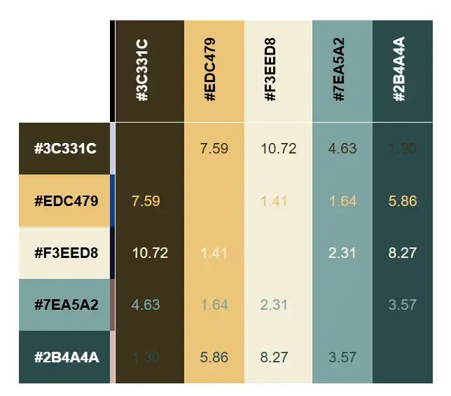

# **Clancy Nook | Walking Tours**
_Project Milestone 1_

## **Contents**

### 1. [Site Overview](#site-overview)
##### i. [Project Criteria](#project-criteria)
##### ii. [Web Developer Showcase](#web-developer-showcase)
##### iii. [Key Goals](#web-developer-showcase)
### 2. [Introduction](#introduction)
### 3. [User Experience (UX)](#user-experience-ux)
#### i. [Strategy](#strategy)
#### ii. [Scope](#scope)
#### iii. [Structure](#structure)
#### iv. [Skeleton](#skeleton)
#### v. [Surface](#surface)
### 4. [Features](#features)
### 5. [Technologies Used](#technologies-used)
### 6. [Testing](#testing)
### 7. [Deployment](#deployment)
### 8. [Acknowledgements](#acknowledgements)

## **Site Overview** 
This Website is a responsive, user-focused website designed for **Clancy Nook**, an experienced tour guide offering historic walking tours around Manchester. This project is developed as part of **Project Milestone 1** for the Code Institute's **Full Stack Web Development program**. The website aims to provide a central hub for tour information, booking, and reviews.

Visit the deployed site on github [here](https://teseolou.github.io/clancy-nook-walking-tours/index.html).

### **Project Criteria**
This project is designed to meet the following key requirements:
1. Create a **static front-end website** of at least 3 pages, or a single scrolling page divided into at least 3 distinct sections.
2. Incorporate **HTML5** and **CSS3** technologies to structure and style the site.
3. Include a **main navigation menu** for intuitive user experience and **responsive design** for different device sizes.
4. Use **semantic markup** and **accessible design principles** to ensure inclusivity.
5. Provide **clear, user-focused content** that fulfills both user and business goals.
6. Host the project on **GitHub Pages**, with version control via Git and complete documentation in a this README.md file.

### **Web Developer Showcase**
As a developer in training, this project aims to demonstrate:
1. Proficiency in HTML5 and CSS3 to create **structured and styled web pages**.
2. The ability to implement **responsive design principles**, ensuring the site adapts seamlessly to mobile, tablet, and desktop devices.
3. Skills in **accessibility-focused design**, following WCAG guidelines for color contrast, navigation, and semantic markup.
4. The capability to organise and manage a project using **Git version control** and clear commit messages.
5. The ability to write well-documented, maintainable code with an emphasis on **user experience (UX)** principles.
6. **Thorough testing and debugging processes** to ensure the site performs as intended across multiple devices, browsers, and screen sizes.
7. Use of **validation tools** (e.g., W3C HTML and CSS Validator) to confirm compliance with modern web standards.
8. Implement **performance analytics tools** such as Lighthouse to optimise the site's performance, accessibility, and adherence to best practices.

### **Key Goals**
The **Clancy Nook** project focuses on achieving the following:
1. Offer an intuitive, engaging platform for tourists, locals, corporate and community clients to learn about and book walking tours.
2. Showcase Clancy Nook's expertise and services offered.
3. Build a professional online presence for Clancy Nook.

## **Introduction**

## **User Experience (UX)**
User experience (UX) design focuses on creating meaningful, efficient, and enjoyable interactions between users and a product or service. For a website, this means designing a platform that meets users’ needs while providing an intuitive and visually appealing interface. 

Prioritising user experience is essential to ensuring that visitors can easily navigate the site, achieve their goals, and enjoy the process. This philosophy is particularly relevant to the Clancy Nook website, where the goal is to cater to a diverse audience of locals, tourists, and corporate clients.

### **Strategy**
The **Strategy Plane** in UX design forms the foundation of any project by aligning business goals with user needs. It addresses fundamental questions about what the website aims to achieve and how it delivers value to its users. 

For Clancy Nook, this meant not only creating an online presence but also ensuring the site serves as a seamless gateway for users to learn about, book, and engage with the historic walking tours offered. The strategy plane was the first port of call in the development process, as it established the overall purpose of the site and guided all subsequent design and development decisions.

By starting with the strategy, the project focused on identifying key objectives—such as enhancing visibility, streamlining booking processes, and showcasing the unique value of the tours—and balancing these with the needs of diverse user groups like tourists, locals, and corporate clients. This foundational step ensured that every feature and design element served a clear purpose, meeting both user expectations and business ambitions.

#### **Initial Discussion**
The development process for the Clancy Nook website began with an in-depth meeting with the client, Louis Cane. During this discussion, we explored key aspects of the business, including:
- The primary goals for the business and the website.
- Insights into Clancy Nook’s current operations, including its use of Linktree, TripAdvisor,  and Eventbrite.
- Current clientele and future clientele.
- Future Goals to expand the business by attracting more corporate clients and building partnerships with community organisations. 

#### **Business Goals**
The following business goals were established for the Clancy Nook website during the initial discussion phase. These goals emerged from a collaborative dialogue with the client, focusing on both immediate needs and aspirations for the future. While some goals centered on creating a strong digital presence and improving user experience, others reflected long-term ambitions, such as attracting corporate clients and collaborating with local communities.

Each business goal is paired with a corresponding call-to-action (CTA) designed to:
- Guide users toward desired actions such as booking a tour, learning more about the guide, or contacting for corporate inquiries.
- Make the website's purpose immediately clear to visitors.

1. **Establish Online Presence**  
Create a professional and user-friendly website to build credibility for Clancy Nook as a premier provider of historic walking tours in Manchester.  
**Call-to-Action:** _"Discover Clancy Nook and explore Manchester's rich history with our guided walking tours. Visit my website to learn more and join our community of history enthusiasts."_

2. **Simplify Booking**  
Integrate seamless links to Eventbrite for easy tour booking while showcasing a personalised contact option for inquiries.  
**Call-to-Action:** _"Book your spot on a Clancy Nook walking tour today through our seamless Eventbrite integration or contact me directly for inquiries."_

3. **Showcase Unique Value**  
Highlight Louis Cane's deep knowledge of Manchester's history and the engaging storytelling that sets Clancy Nook apart from other tours.  
**Call-to-Action:** _"Experience Manchester’s history like never before with Clancy Nook, your expert guide and storyteller."_

4. **Provide a Central Hub for Tour Information**  
Serve as a central resource for tour details, showcasing engaging images, insightful descriptions, and glowing testimonials to entice potential customers.  
**Call-to-Action:** _"Find all the details you need in one place—tour schedules, meeting points, and review - all at your fingertips."_

5. **Encourage Repeat Customers**  
Build customer loyalty by offering exclusive updates on new tours or events through an optional newsletter signup.  
**Call-to-Action:** _"Stay in the loop! Follow us on social media for updates on new tours and exclusive events."_

6. **Attract Corporate Clients** (Future Goal)  
Expand Clancy Nook's reach to the corporate world by showcasing tailored private tours for businesses, including team-building events, company outings, and cultural excursions.  
**Call-to-Action:** _"Looking for a unique team-building experience? Contact me to arrange private walking tours."_

7. **Facilitate Opportunities to Work with Communities** (Future Goal)  
Foster connections with local communities by offering concession rates or free tours for underserved groups, contributing to the city’s cultural inclusivity.  
**Call-to-Action:** _"Partner with Clancy Nook to make history accessible to all. Reach out for details about our community-focused tour initiatives."_

Goals 6 and 7, while not central to the website's initial development, represent aspirational objectives for the business’s growth and social impact. By planting the seeds for these initiatives now, the site can evolve over time to accommodate these long-term ambitions.

#### **User Demographics**
Understanding attends and books Clancy Nook tours establishes clear user demographics, which permitted the identification of key user groups, their needs, and their motivations. These in turn informed the development of tailored user stories and features for the website. By analysing the clientele and tour attendance patterns, we could align the website's functionality and content with the expectations of the target audience. This ensured that every feature and piece of information on the site would resonate with its users and provide maximum value.

The demographics were broken down by tour type to account for the unique audience profiles each tour attracts:
- **City Center Tour:**
  - **60-70% Mancunians:** Local history enthusiasts seeking to deepen their understanding of the city.
  - **20-30% Tourists or Visitors:** Out-of-town guests looking to explore Manchester's cultural and historical highlights.
  - **Diverse Audience Mix:** Includes families, students, and older adults.

- **Whalley Range Tour:**
  - **Majority Local Residents:** Individuals with a vested interest in the area's history or personal connections.
  - **New Residents:** Those wanting to learn about the neighborhood they now call home.
  - **Former Residents:** Occasional attendees revisiting for nostalgic reasons.

- **Ancoats Tour:**
  - **80-90% from the Wider Manchester Region:** Predominantly history enthusiasts who appreciate the industrial heritage of Ancoats.
  - **Currently Lacking Local Attendance:** Attracting Ancoats locals remains a growth area and a goal for the tour guide.

#### **Target Audiences**

The insights gathered from the demographic analysis and business goals allowed us to define the following target audiences for the Clancy Nook website. Each audience group aligns with specific business goals, helping to establish clear connections between user needs and the website's features.

1. **New Users - Prospective Customers:**  
   First-time visitors exploring Clancy Nook and seeking information about tours to decide on booking.

2. **Returning Users:**  
   Loyal customers looking for updates, new tours, and opportunities to engage further.

3. **Locals:**  
   Residents of Manchester or surrounding areas interested in deepening their connection to the city’s history.

4. **Tourists:**  
   Visitors to Manchester who want to learn about its cultural and historical highlights in an engaging way.

5. **Corporate Users (Businesses) - Prospective Customers:**  
   Businesses interested in private tours for team-building events, company outings, or corporate retreats.

6. **Community Leaders (Non-profits/Schools) - Prospective Customers:**  
   Organisations looking to collaborate with Clancy Nook for concession-priced or free educational tours tailored to their needs.

#### **User Stories** 
For this project, user stories developed capture the diverse needs of Clancy Nook’s target audience, ensuring the website provides a user-centric experience. The creation of user stories helped define what different user groups—such as locals, tourists, corporate clients, and returning users—expect from the website. These stories bridge the gap between user needs and the technical development process, ensuring every feature contributes to a positive user experience and serve as a roadmap for development and guiding design decisions. 
 
To ensure effective and timely delivery, the user stories were divided into three priority categories: **must-have**, **should-have**, and **could-have**. These categories reflect the essential, important, and desirable features for the website.

- **Must-Have** stories represent the core functionalities that the website cannot succeed without. These include fundamental aspects like clear navigation, booking instructions, contact form and reviews.  
- **Should-Have** stories include features that enhance the user experience and cater to specific user groups, such as social media links and private tour information.  
- **Could-Have** stories consist of advanced or supplementary features that, while not essential, would add extra value if implemented, such as downloadable brochures or storytelling audio clips.  

This prioritisation ensures that critical features are developed first while leaving room for additional improvements based on time and resources.

Must-Have
>_As a **tourist**, I want the website to be easy to navigate, allowing me to quickly find tour information._  
>_As a **local**, I want to read about the guide’s expertise and background so that I can appreciate the depth of historical knowledge offered._  
>_As a **new user**, I want clear instructions on how to book tours so that I can easily reserve my spot on a Clancy Nook tour._ 
>_As a **new user**, I want to learn about the tours’ themes and details so that I can decide which tour to book._  
>_As a **local**, I want to see reviews from other attendees so that I can feel confident about the tour’s quality._  
>_As a **returning user**, I want to be able to write a review so I can encourage others to book a tour._
>_As a **returning user**, I want to be able to contact the tour guide so I can ask about upcoming tours._  
>_As a **returning user**, I want to find other available tours so that I can book a different tour._  
>_As a **local**, I want to easily contact the tour guide so that I can ask about specific tour routes._  
>_As a **new user**, I want to know how to contact the tour guide so I can ask questions about the services they offer._  
>_As a **tourist**, I want to easily contact the tour guide so that I can ask which tour would be most suitable for me._  

Should-Have
>_As a **corporate user**, I want to find information about private tours for businesses so that I can book a group experience._  
>_As a **returning user**, I want to find social media links in the footer so that I can follow updates and share my experience._  
>_As a **new user**, I want to view a gallery of images from past tours so that I can get a sense of the experience._  
>_As a **tourist**, I want to access clear meeting point details so that I can find the starting location easily._  
>_As a **business owner**, I want to easily contact the tour guide so that I can ask about availability for private tours._  
>_As a **community leader**, I would like to be able to contact the tour guide so I can ask them about community concession rates._

Could-Have
>_As a **corporate user**, I want downloadable PDFs or brochures about corporate tours so that I can easily share them with my team._  
>_As a **tourist**, I want media clips or snippets of the guide’s storytelling so that I can preview the experience before booking._  

By creating and prioritising these user stories, the website ensures a structured, user-focused development process that delivers meaningful value to both users and the business.

#### **Emerging Website Components**
The analysis of user needs and expectations highlighted several critical components that would form the foundation of the Clancy Nook website. These components were designed to address the goals of both the business and its diverse user base, ensuring a user-friendly, informative, and engaging experience. Below are the core website components that emerged during the planning phase:
1. **About Section**  
   Including information about the guide’s historical knowledge and storytelling abilities emphasises the unique value Clancy Nook offers, particularly appealing to locals and history enthusiasts.

2. **Tours Information**  
   Providing clear and accessible details about available tours, including themes, schedules, meeting points, and additional details, was identified as a top priority. This ensures users can quickly learn about the experiences offered.

3. **Booking Options**  
   A streamlined booking process via integrated links to Eventbrite, combined with a user-friendly contact form for bespoke inquiries, makes securing a spot on a tour simple and efficient.

4. **Contact Form**  
   A dedicated contact section provides users with an easy way to reach out for questions, inquiries about bespoke tours, or to request additional information, ensuring seamless communication.

5. **Transparent Pricing**  
   Highlighting pricing information, including the pay-what-you-can option, ensures users understand the cost of the tours. This transparency encourages bookings while showcasing Clancy Nook's accessibility for a wider audience.

6. **Group Booking Section**  
   Dedicated sections for corporate users and community leaders provide tailored information about private and group tours. This includes details on how these tours can be customised to meet specific needs, reinforcing the business’s appeal to a broader audience.

7. **Reviews Access**  
   Featuring testimonials and reviews from past attendees helps build credibility and trust, particularly for new users and locals seeking assurance of tour quality.

8. **Image Gallery**  
   A gallery showcasing images from past tours provides a visual representation of the experiences offered. This component is designed to engage tourists and returning users, giving them a sense of the atmosphere and storytelling that Clancy Nook tours provide.

9. **Social Media Integration**  
   Social media links in the footer encourage users to stay connected with Clancy Nook, providing updates and opportunities to share their experiences. This fosters community engagement and increases the visibility of the tours.

10. **Supplementary Media**  
    Supplementary resources, such as downloadable PDFs or brochures for corporate and private tours, provide businesses with shareable materials to aid in internal planning. Additionally, audio or video snippets of the guide’s storytelling offer a unique preview of the experience for prospective customers, enticing them to book a tour.

#### **Importance/Feasibility**
The Importance/Feasibility analysis evaluates each website component based on two criteria: importance and feasibility. Importance refers to how critical the component is to achieving the business goals and addressing user needs outlined in the user stories. Feasibility, on the other hand, assesses the practicality of implementing the component within the project's constraints (e.g., timeline, resources, and technical expertise).

This analysis ensures that the development process prioritises components that deliver the most value while remaining achievable. By striking this balance, the project remains focused and efficient, delivering the maximum possible impact within its constraints.

The table below rates each component on a scale of 1 to 5 for both importance and feasibility:
- **Importance:** A rating of **1** means the component has low relevance to business goals or user stories, while a **5** signifies that the component is essential.
- **Feasibility:** A rating of **1** indicates that the component is difficult to implement within the project's constraints, while a **5** means it is straightforward to achieve.

| **Component**             | **Importance** | **Feasibility** |
| ------------------------- | -------------- | --------------- |
| About Section             | 5              | 5               |
| Tours Information         | 4              | 4               |
| Booking Options           | 4              | 3               |
| Contact Form              | 5              | 4               |
| Transparent Pricing       | 3              | 5               |
| Group Booking Information | 3              | 4               |
| Reviews Access            | 4              | 2               |
| Image Gallery             | 3              | 3               |
| Social Media Integration  | 3              | 5               |
| Supplementary Media       | 1              | 2               |

The graph below illustrates the relationship between importance and feasibility for each component. Components plotted closer to the top-right corner are both high in importance and feasible, making them top priorities for the project. Components in other quadrants help identify where compromises or adjustments may be needed.

Graph Insights:
- **High Importance & High Feasibility**: Components such as the **About Section**, **Contact Form**, **Tours Information**, and **Transparent Pricing** appear in this quadrant, making them the highest priority for the website. These are the backbone of the user experience and directly align with Clancy Nook’s primary goals of establishing credibility, simplifying bookings, and providing clear information.
  
- **High Importance & Moderate Feasibility**: Features like **Booking Options**, **Group Booking Information**, and **Reviews Access** are essential but require careful implementation. For example, while **Reviews Access** is crucial for building trust and encouraging bookings, the additional design and structural requirements make it slightly more complex to integrate. Nonetheless, it is still a key feature to include, especially as it directly supports the site's credibility and aligns with user needs for confidence in the service.
  
- **Moderate Importance & High Feasibility**: **Social Media Integration** stands out as a low-effort, high-reward feature. Adding social media icons in the footer enhances user engagement and encourages sharing without significantly increasing development complexity.

- **Low Importance & Low Feasibility**: Features like **Supplementary Media**, including brochures and audio snippets, rank lower in priority. While they could enhance the user experience, they are considered optional for the project's minimal viable product (MVP).

#### **Project Planning**
This analysis directly informs project planning by providing a clear roadmap for prioritising features during development. Using the _GitHub Projects Board_ [here](https://github.com/users/TeseoLou/projects/3/views/2), I can allocate tasks based on importance and feasibility, ensuring high-priority components are delivered first. This approach aligns with the concept of a **Minimal Viable Product (MVP)**.

The **Scope Plane** in UX design also comes into play here, ensuring that the identified components fit within the project's constraints while still delivering a meaningful experience. By focusing on features in the high-importance/high-feasibility quadrant and working down, the project remains achievable without sacrificing value.

### **Scope**
The Scope Plane in UX design addresses the functional and content requirements necessary to fulfill the strategic objectives outlined in the Strategy Plane. While the Strategy Plane defines _why_ the project exists and _who_ it serves, the Scope Plane determines _what_ the website needs to achieve those goals.

The Scope Plane encompasses both **functional requirements** (features and interactivity) and **content requirements** (information and media). These elements work together to deliver a seamless user experience that meets user needs and supports the business objectives. By focusing on the scope early in the process, developers can outline a clear plan that ensures every feature or piece of content serves a defined purpose, avoiding feature creep or misaligned priorities.

For the Clancy Nook website, the Scope Plane is essential to identifying the core features of the website by establishing what functional and content requirements will enable the project to meet its business goals and user needs effectively. The _Components_, _User Stories_, and _Business Goals_ presenting previously play a crucial role in defining and prioritising these requirements, ensuring the project remains focused and aligned with its objectives.

#### **Deriving Requirements**
Through this analysis, it becomes evident that the components summarise the essential requirements for the website in terms of what must be achieved to deliver value to both users and the business. These requirements naturally prioritise themselves into three categories: must-have, should-have, and could-have requirements.

Must-Have
- Give the Users an Overall Feel for the Brand/Aesthetic
- Share Information about Clancy Nook
- Present the Available Tours
- Provide Clear Pricing Information
- Guide Users Through the Website Seamlessly
- Receive Communications from Users
- Show Reviews from Previous Clients
- Enhance User Engagement and Accessibility
- Instruct Users on How to Book

Should-Have
- Share Images from Previous Tours
- Link to Various Social Media Outlets
- Enable Users to Submit Their Own Reviews
- Showcase Concession or Community Rates
- Offer Private Booking Information

Could-Have
- Provide Supplementary Media

#### **Functional Requirements**
Functional requirements define the features and behaviors a website must have to meet user and business goals. In UX design and development, they ensure the website functions as intended, allowing users to navigate, submit forms, and access information easily. During development, these requirements act as a blueprint, helping prioritise tasks and allocate resources, ensuring the site fulfills its purpose, from booking tours to sharing reviews effectively.

To determine which project requirements have functional requisites, we need to review the user stories, business goals, and UX components. I have categorise functional requirements based on their scope and application:
- **Macro Functions:** Apply universally across the entire website (e.g., responsive navigation, accessibility).
- **Meso Functions:** Apply across multiple but not all pages or features (e.g., booking and review instructions).
- **Micro Functions:** Apply to specific sections or elements (e.g., the contact form functionality, image gallery).

Must-Have
- **Macro**:
  - Seamless navigation across pages.
  - Accessibility features (e.g., alt text, keyboard navigation).
  - Responsive design for all devices.
  - Functional links to booking options (Eventbrite).
- **Meso**:
  - Clear booking links.
  - Tour highlights.
  - Intuitive navigation with feedback animations.
- **Micro**:
  - Functional contact form for user inquiries.
  - Accessible reviews from past clients.
  - Clearly displayed dynamic pricing information.

Should-Have
- **Macro**:
  - Social media icons linking to platforms.
  - User-generated content uploads (e.g., photos, reviews).
- **Micro**:
  - Responsive Gallery Page.
- **Meso**:
  - Option for users to submit reviews directly via the site or linked platforms.

Could-Have
- **Meso**:
  - Supplementary downloadables, e.g, PDFs of tours.
- **Micro**:
  - Features for private bookings, e.g., pre-filled forms.
  - Playable media e.g., media snippets of guide or tour previews.

#### **Content Requirements**
Content requirements are the textual, visual, and aesthetic elements a website needs to meet user needs and fulfill its purpose. They translate the website's strategy and scope into tangible components that align with business goals and user stories.

For Clancy Nook, content requirements provide the _what_ and _how_, filling the website's framework and ensuring users can access relevant materials like tour information, imagery, and branding elements, directly enhancing the site's usability and overall user experience (UX).

Content is the information users interact with on a website. It drives engagement, builds trust, and communicates value. For Clancy Nook, clearly defined content requirements help ensure users can easily read and understand essential information, like tour schedules and pricing and create a visually appealing and cohesive aesthetic to align with the brand's identity.

To ensure a comprehensive and organised development process, the content requirements are divided into the following categories:
- **Graphic Content:** These elements represent visual assets that enhance user engagement and showcase Clancy Nook's unique identity.
- **Textual Content:** Convey essential information and guide users through the website.
- **Aesthetic Content:** These elements define the visual presentation of the website and reinforce the brand.
- **Interactive Content** This category includes dynamic content elements that facilitate user interaction.

Must-Have
- **Graphic**
   - Professional Logo
   - Tour Image
   - Image of Tourguide
- **Textual**:
   - Tour Information
   - Page/Section Headings
   - Tour Details
   - Contact Information
- **Aesthetic**: 
   - Cohesive Color Palette
   - Readable Typography
- **Interactive**: 
   - Links to Booking/Review Platforms
   - Contact Forms Elements

Should-Have
- **Graphic**:
   - More Imagery of Tours
- **Textual**: 
   - Reviews from Past Clients
- **Interactive**: 
   - Social Media Links

Could-Have
- **Graphic**: 
   - High-quality, Videos of Guide and Tours
- **Textual**:
   - Downloadable brochures

#### **Core Features**
Core Features outline the key parts integrated into the Clancy Nook website to ensure it meets both user and business goals. These features stem from the previously defined strategy and scope, helping prioritise functionality and content into deliverables.

Each feature has been categorised as a must-have, should-have, or could-have, based on its importance and feasibility, and further classified as Site, Page, Section, or Elemental Features to clarify its scope of application.

| Component                               | Importance | Feasibility | Category  | Scope Priority |
|-----------------------------------------|------------|-------------|------------|---------------|
| Navbar at top of page & footer navigation buttons | 5 | 5 | Website  | 🔴 **Must-Have** |
| Footer                                  | 5 | 5 | Website  | 🔴 **Must-Have** |
| Accessibility features (alt text, aria-label, contrast, readable fonts) | 5 | 5 | Website  | 🔴 **Must-Have** |
| Responsive design for all devices       | 5 | 5 | Website  | 🔴 **Must-Have** |
| Homepage                                | 5 | 5 | Page     | 🔴 **Must-Have** |
| Tours Page                              | 5 | 4 | Page     | 🔴 **Must-Have** |
| Contact Page                            | 5 | 4 | Page     | 🔴 **Must-Have** |
| Success Page                            | 4 | 4 | Page     | 🔴 **Must-Have** |
| 404 Error Page                          | 4 | 5 | Page     | 🔴 **Must-Have** |
| About Section                           | 5 | 5 | Section  | 🔴 **Must-Have** |
| Tour Summarising                        | 4 | 4 | Section  | 🔴 **Must-Have** |
| Links to platforms (Eventbrite, TripAdvisor) | 4 | 4 | Elemental | 🔴 **Must-Have** |
| Contact Button                          | 5 | 5 | Elemental | 🔴 **Must-Have** |
| General Inquiries Option on contact form | 5 | 5 | Elemental | 🔴 **Must-Have** |
| Contact Details                         | 5 | 5 | Elemental | 🔴 **Must-Have** |
| Gallery Page with images from past tours | 4 | 4 | Page     | 🟡 **Should-Have** |
| Reviews Page for feedback from past customers | 4 | 3 | Page     | 🟡 **Should-Have** |
| Private Bookings Section                | 4 | 3 | Section  | 🟡 **Should-Have** |
| Community/concession rates section      | 3 | 3 | Section  | 🟡 **Should-Have** |
| Social Media Links                      | 4 | 5 | Elemental | 🟡 **Should-Have** |
| Review option on contact form           | 4 | 3 | Elemental | 🟡 **Should-Have** |
| Booking option on contact form          | 4 | 3 | Elemental | 🟡 **Should-Have** |
| Dedicated section for private bookings & group tours | 3 | 3 | Page     | 🟢 **Could-Have** |
| Supplementary media (downloadable brochures, audio clips) | 2 | 2 | Section  | 🟢 **Could-Have** |
| Embedded video snippets showcasing storytelling | 2 | 2 | Elemental | 🟢 **Could-Have** |

Explanation of Colors:  
🔴 **Must-Have (Red)** → Critical to the website’s function & user experience  
🟡 **Should-Have (Yellow)** → Important enhancements but not vital for MVP  
🟢 **Could-Have (Green)** → Nice-to-have features 

#### **Project Plannning**
The work in this section has been instrumental in establishing clear acceptance criteria and actionable tasks, which are tracked on my GitHub Projects Board [here](https://github.com/users/TeseoLou/projects/3/views/2). This process ensures a focused and efficient approach to meeting user needs and business goals.

In organising and classifying features, I’ve also laid the groundwork for the website’s structure. This strategic planning naturally transitions into the **Structure Plane**, where the flow of information and navigation will align with the core features defined here, ensuring a seamless user experience.

### **Structure**
The **Structure Plane** in User Experience (UX) design focuses on how the information within the project is organised and how the users will interact with that information. It bridges the gap between the abstract elements of the strategy and scope and the more concrete aspects of the user interface, defining how the users will experience the navigation and interaction with the website.

The Structure Plane encompasses navigation, which demands a clear and consistent navigation scheme that reflects the importance and relationships of different core features. Additionally, interaction design is essential in defining how users will interact with the website’s interface. This involves deciding on interaction models, selecting appropriate UI elements such as buttons, forms, and sliders, and designing feedback mechanisms that inform users of the system's responses to their actions. Furthermore, developing an effective information architecture is crucial. This includes organising the website content in a logical manner for the target audience and may involve techniques like card sorting to involve users in the organisation process.

For Clancy Nook, this section sets the framework for organising the content and functionality in a way that is intuitive and user-friendly. Key considerations including mapping out the user flow to cover the user stories and ensure that the navigation structure supports these journeys. Maintaining consistent patterns in layout and design is also vital in promoting instinctual navigation through the site as well as sticking to best practice. Furthermore, ensuring that the structure accommodates differently abled users, such as ensuring semantic elements are appropriate and aria-labels are descriptive will ensure screen reader compatibility. 

#### **_MoSCoW_ Prioritisation**
So far in this project,  prioritising effectively according to business goals, user needs, and developer capabilities has been crucial. With the project scoped to develop a fully functional front-end site within a specific timeframe, continuously reevaluating priorities and core components ensures timely deployment while balancing essential and additional features.

Effective prioritisation is key for web developers, especially under tight deadlines. To manage this, the MoSCoW prioritisation technique has been integral for me, in categorising tasks. So far, categorising tasks into Must-Have, Should-Have, and Could-Have has allowed me to focus resources effectively and meet critical milestones. Now, I introduce the final component in this model: the Won't-Have.

Introducing Won't-Have's marks a strategic decision to recognise and set aside features that are not feasible at this stage due to current constraints in timeframe, project requirements, skillset, or client resources. This categorisation is not about permanently discarding features but rather temporarily setting aside those that, while valuable, are not possible for the initial launch.

Unlike Could-Have items, which remain on my roadmap for potential inclusion for this project (if time and resources allow), Won't Have elements are not planned for this project phase at all. By clearly defining what will not be included in the initial deployment, I set the stage for future enhancements, as I develop more advanced skills and additional resources are secure by the client. 

Several features have been relocated to the Won't-Have category due to current constraints in skillset, resources, and project scope. Here is a concise breakdown of these features:

- **Community/Concession Rates**
   - Client is still finalising details for community and concession rates.
- **Form Submission Functionality**
   - Real back-end form submission capabilities exceed my current skills, limiting forms to front-end functionality only.
- **Ability to Book on the Website**
   - Direct booking requires back-end skills and integration with reservation and payment systems, which are beyond the current project scope.
- **Supplementary Media like Downloadable Brochures**
   - Absence of client-created content for downloadable brochures delays this feature.

| **Component**             | **Importance** | **Feasibility** | **Priority (MoSCoW)** |
|--------------------------|--------------|---------------|------------------|
| **About Section**             | 5            | 5            | 🔴 **Must-Have** |
| **Tours Information**        | 4            | 4            | 🔴 **Must-Have** |
| **Booking Options**         | 4            | 3            | 🔴 **Must-Have** |
| **Contact Form**            | 5            | 4            | 🔴 **Must-Have** |
| **Transparent Pricing**      | 3            | 5            | 🔴 **Must-Have** |
| **Group Booking Information** | 3          | 4            | 🟡 **Should-Have** |
| **Reviews Access**          | 4            | 2            | 🟡 **Should-Have** |
| **Image Gallery**           | 3            | 3            | 🟡 **Should-Have** |
| **Social Media Integration** | 3            | 5            | 🟡 **Should-Have** |
| **Supplementary Media**      | 1            | 2            | 🟢 **Could-Have** |
| **Community/Concession Rates** | 3  | 2   | 🔵 **Won’t-Have** 🚫 |
| **Form Submission Functionality** | 4 | 2  | 🔵 **Won’t-Have** 🚫 |
| **Ability to Book on the Website** | 5 | 1  | 🔵 **Won’t-Have** 🚫 |
| **Downloadable Brochures** | 2  | 2  | 🔵 **Won’t-Have** 🚫 |

Explanation of Colors:  
- 🔴 **Must-Have (Red)** → Critical to the website’s function & user experience  
- 🟡 **Should-Have (Yellow)** → Important enhancements but not vital for MVP  
- 🟢 **Could-Have (Green)** → Nice-to-have features  
- 🔵 **Won’t-Have (Blue)** → Not feasible for this phase due to scope/time constraints  

#### **Site Hierarchy**

Site hierarchy refers to the organisation and structure of a website’s content and navigation. It determines how information is grouped, categorised, and accessed by users, impacting how efficiently they can find what they need. A well-structured site hierarchy enhances usability, accessibility, and overall user experience (UX) by guiding users through the website in a logical, intuitive way.

From a UX perspective, site hierarchy plays a crucial role in:
- Ensuring easy navigation so users find key information quickly.
- Minimising frustration by preventing unnecessary clicks or confusion.

When designing a navbar and site structure, **standard best practices** guide how content is prioritised. These principles ensure a good user journey:

1. The homepage 
   - Should always be the first navigation item.  
   - This serves as the starting point for users to explore the site.

2. Pages arranged in a logical order  
   - Main content comes first (e.g., Tours).  
   - Supplementary content follows (e.g., Gallery, Reviews).  
   - Action-oriented items (e.g., Contact) appear last or are highlighted.

3. About sections are commonly integrated into the homepage rather than a standalone page.  
   - Many sites place the About section on the homepage, ensuring quick access while keeping navigation concise.

4. Primary actions should be made visually distinct.  
   - The most important action (e.g., "Contact") should stand out using color or styling.

5. Supporting Functional Pages:  
   - A 404 Error Page ensures that users are properly redirected if they encounter a broken link.  
   - A Success Page provides confirmation after users complete a form submission, reinforcing positive engagement.

By following these principles, the Clancy Nook website will provide an intuitive user experience that aligns with expectations. I have identified which features should be standalone pages and which should exist as sections within pages.

| **Page Name**   | **Purpose** |
|------------|---------|
| **Home**   | Provides an overview of Clancy Nook, highlights key tours, and includes an embedded About section. |
| **Tours**  | Lists all available walking tours, including details on themes, schedules, and booking options. |
| **Gallery** | Showcases images from past tours to visually engage users. |
| **Reviews** | Features testimonials and feedback to build credibility. |
| **Contact** | Provides a contact form, direct contact details, and social media links. |
| **Success Page** | Confirms form submissions, ensuring users know their request was received. |
| **404 Error Page** | Provides an accessible, helpful page when users land on a broken or missing link, guiding them back to relevant content. |

The pyramid diagram visually represents the hierarchical structure of the Clancy Nook website, showing the relationships between the pages based on importance, functionality, user frequency and journey.

To clearly define the purpose and function of each page, I have assigned labels (_Who, What, Where, When, Why, How, Help, Witness, Worth, Welldone, and Whoops_) to to understand how each page serves user needs and supports Clancy Nook’s business goals.

1. Homepage - _Welcome, What & Why_
   - The homepage acts as the entry point, introducing Clancy Nook and the services provided.
   - As the most visited page, it acts as the primary entry point for users.
   - The About section is placed within the homepage, aligning with standard practices.
   - A brief preview of the available tours designed to engage and attract potential participants.

2. Contact Page _How & Help_
   - Many users will navigate to this page after exploring the site, making it a key component of the hierarchy.
   - Serves a crucial role in the business.
   - Highlighting the "Contact" will encourages users to first explore the site, then take action.  
   - It is visually distinct in the navbar to emphasise its importance.

3. About Section - _Who_
   - Provides essential background on Clancy Nook.
   - While not a standalone page, it is a key section on customer journeys.

2. Tours as the Central Page - _Which, Where & When_
   - Core offering
   - Center page of the customer journey (beyond the starting homepage and ending contact page).

3. Gallery & Reviews as Supporting Pages  - _Witness & Worth_
   - These help build trust and provide additional engagement but are secondary to the tours themselves.
   - Offers a visual representation of past tours, helping potential customers get a feel for the experience.
   - Showcases testimonials from previous customers, reinforcing credibility and trust.

5. Success Page & 404 Page as Supporting Functional Pages - _Welldone & Whoops_
   - The Success Page provides a confirmation message after users submit a form, preventing confusion.  
   - The 404 Error Page ensures users are given helpful redirection options rather than encountering a dead end.

The finalised navbar order follows both best practices and business goals:

This ensures a logical and effective user journey, guiding visitors through exploring tours, seeing testimonials, and finally contacting the guide.

The Success Page and 404 Page will exist as functional pages but will not appear in the navigation. Instead:
- The Success Page is triggered after form submissions.
- The 404 Error Page will automatically load if users enter an incorrect or broken URL.

Web designers follow established principles when creating site hierarchy to ensure a seamless experience:

#### **Navigation**
Effective navigation is fundamental to user experience (UX) design, ensuring users can explore the website intuitively while being guided toward key actions. Standard navigation best practices emphasise clarity, consistency, and accessibility, making it easy for users to find what they need while supporting the business’s objectives.

For the Clancy Nook website, navigation is structured to balance free access via the navbar with a logical journey between related pages, aligning with standard web design conventions, user needs, and business goals. Good website navigation follows three key principles:

1. **Predictability** – Users should know where to go next without confusion.  
2. **Efficiency** – Important pages should be accessible within one or two clicks.  
3. **Guidance** – While users can explore freely, the site should encourage a natural progression.

Navigation directly supports Clancy Nook’s business objectives by, promoting tour bookings (where the tours page provide a focal point of the site, with multiple entry points leading users there), building trust (as the reviews and gallery pages reinforce credibility, leading users towards booking), and encouraging engagement (by providing prominent contact options). By structuring the navigation around user intent and business priorities, the site helps new visitors discover Clancy Nook, validate its credibility, and complete a booking inquiry effortlessly.

As a standard web convention, the navbar appears across all pages, giving users immediate access to:

**📌 Home 📌 About 📌 Tours 📌 Gallery 📌 Reviews 📌 Contact**  

This reflects a widely recognized pattern in website navigation, where the website is structured to encourage a natural progression through interconnected pages.

1. **Homepage** serves as the entry point  
2. **About Section** follows, providing background context.  
3. Core service (**Tours Page**) takes central focus.  
4. Supporting content (**Gallery & Reviews Pages**) enhances credibility.  
5. **Contact Page** remains a prominent final step for conversions.

While the Success Page and 404 Error Page are not part of the core navigation, they still play an essential role in the site's user experience. These pages exist within the Clancy Nook website, ensuring users remain within the site's ecosystem.

**🎉 Success ❌🔗 404 Error**

6. **Success Page** provides confirmation after a form submission, reassuring users that their action was completed successfully. It prevents uncertainty and offers a clear next step, such as returning to the homepage or exploring more tours.
7. **404 Error Page**  provides helpful redirection options to guide them back to relevant sections of the site, such as the homepage or tours page. This is if users reach a broken or non-existent link, the 404 page ensures they are not met with frustration.

Certain actions require external platform navigation, integrated seamlessly into the user journey:

**🔗➡️ Booking 🔗➡️ Review 🔗➡️ Social Media**

8. Booking (**Eventbrite**) – Linked from the Tours and Contact pages.  
9. Review Platform (**TripAdvisor**) – Linked from the Reviews page.  
10. **Social Media** – Found in the footer and relevant sections for engagement.

This ensures that while external tools handle bookings and reviews, users always feel anchored within the Clancy Nook website.

This diagram illustrates the navigation of the Clancy Nook website, showing how users can move between core pages such as Home, About, Tours, Gallery, Reviews, and Contact. It also depicts external navigation links to social media, booking, and review platforms, as well as functional pages like the 404 Error and Thank You pages, which guide users when they encounter errors or complete actions.

#### **User Interaction (UI)**
Interaction design plays a crucial role in shaping how users engage with the website’s interface. It involves determining effective interaction models, selecting suitable UI elements like buttons, forms, and sliders, and implementing feedback mechanisms that provide users with clear responses to their actions. The goal is to create an intuitive and engaging experience that aligns with user expectations and business objectives.

Effective interaction design follows industry best practices to ensure intuitive usabiity:

- Provide clear and predictable interactions, minimizing user frustration.
- Implement visual feedback mechanisms (such as hover effects, form validation, and confirmation messages).
- Use sticky navigation or footers for quick access to essential functions.
- Design forms with dropdowns, auto-fill options, and validation messages to enhance usability.
- Ensure smooth scrolling for intuitive page transitions, especially on mobile devices.

The Clancy Nook project applies these best practices while considering previous design decisions to guide users through the site. Therefore: 

1. Navbar elements are designed to be intuitive, ensuring users can easily explore tour options and make inquiries.
2. The footer provides additional navigation buttons, improving accessibility without cluttering the main interface.
3. The booking process is streamlined, with clear CTAs directing users to external platforms such as Eventbrite.
4. Forms use conditional fields, while providing real-time feedback for missing or incorrect inputs.
5. Error handling mechanisms (such as the 404 page) prevent dead ends, guiding users back to relevant content.
6. A success page confirms user actions, ensuring clarity after a form submission.

#### Navbar
This is a crucial aspect of user experience, ensuring that users can simply move between different sections of the website. By providing a **sticky** navigation bar that remains at the top of the screen as users scroll. This ensures that users can quickly access key pages without needing to scroll back to the top, improving usability and accessibility. 

#### Navicons
A **fixed** footer will remain at the bottom of the page, providing additional navigation buttons for quick access to key areas and social media pages.

#### Buttons
"Text" Buttons will also guide users through the website. 

- **Contact** button is prominently placed to ensure easy access to making enquiries. 
- **Submit** button will be included in the contact form, providing clear action confirmation. 
- **Home**" button will be available on the 404 Error and Success pages, allowing users to easily navigate back to the main site.

Each button will have a corresponding call-to-action, encouraging users to take the next step, whether it's making an inquiry or finalizing a booking.

"Logo" buttons for _Eventbrite_ and _TripAdvisor_ will be placed on the Tours and Reviews pages, respectively. These buttons provide direct access to Eventbrite for booking tours and TripAdvisor for reading and submitting reviews, ensuring a seamless transition to these external platforms.

#### Clickable Tour Cards
Another interactive feature designed to enhance user engagement is the clickable tour cards on the homepage. These cards provide a brief summary of each featured tour, giving users an overview of the available experiences. To encourage interaction, users will be able to click on a card, which will take them directly to the corresponding tour section on the Tours page. This will include:

- **Hover Effects**, where the card will expand slightly and a shadow will appear to create a sense of depth.
- A **call-to-action** at the beginning of the section, informing users that they can click on any tour for more details.

#### Image Carousel
To enhance the user experience on the Tours pages, image carousels will be implemented, allowing users to easily browse through historic photos of landmarks featured on the tours. These interactive elements provide a dynamic visual preview of the experiences offered, helping potential customers make informed decisions. To balance convenience with interactivity, each carousel will include:

- **Four Photos**
- **Automatic Rotation**
- **Previous** and **Next** Buttons 

#### Form Fields
The contact form provides a simple and accessible way for users to ask questions or make inquiries. To improve usability and streamline interactions, several design choices enhance the user experience.

- **Required Fields** prevent form submission unless all necessary details are provided, improving data accuracy.
- **Error Handling** and **Validation** notify users of missing or incorrect entries, prompting them to make corrections before submitting.
- **Dropdown Select** allow users to select predefined options, reducing input errors and making the form easier to complete.
- **Conditional Fields** dynamically appear based on the selected message subject, ensuring users only see relevant input fields, reducing clutter and improving efficiency.
- **Radio Buttons** enable users to quickly select a specific tour, simplifying the booking or inquiry process.
- **Rating Slider** allows users to provide feedback on their experience, offering an intuitive way to rate tours.
- **Image Upload** functionality enables users to submit images (JPEG and PNG formats only), allowing them to share photos relevant to their inquiry or review.
- **Placeholders** guide users through the required fields, ensuring they understand what information is needed.

#### **Information Architecture (IA)**
The structuring, organisation, and labeling of website content ensures users can easily navigate and find relevant information. This critical aspect of user experience (UX) design, influences how content is grouped, connected, and accessed.

When designing a website's information architecture, several key principles are considered to ensure an intuitive and user-friendly experience:

1. **Hierarchy & Organization**: Content is structured logically, with core pages easily accessible through the navigation bar, and supplementary content grouped into relevant sections.
2. **Logicality & Flow**: The structure follows a natural user journey, ensuring that pages and sections connect in a way that makes sense. Users are guided seamlessly from broad introductory content to specific details, reducing friction and cognitive load.
3. **Findability & Accessibility**: Users should be able to locate key information efficiently, with minimal clicks.
4. **Consistency**: Layout, terminology, and navigation patterns remain uniform across all pages to reduce confusion.
5. **Scalability & Flexibility**: The structure allows for future growth, ensuring new content can be integrated without disrupting usability.

This diagram visualizes information architecture for the site as well as the the hierarchy and relationships between pages, interactive elements, and external links. The structure follows established UX best practices while integrating the project's strategic goals.

#### Core Pages & Sections
The website is divided into five main pages, each containing sections and interactive elements that contribute to an efficient user journey:
1. Homepage:
   - Serves as the entry point and provides a structured overview of Clancy Nook’s offerings.
   - Contains the About section and a Featured Tours section, which links directly to detailed tour pages.
2. Tours Page:
   - The core service page listing available walking tours.
   - Contains individual tour sections (e.g., A Tale of Two Cities, True Crime in Ancoats).
   - Integrates Booking Guidance, which directs users to external platforms for reservations.
3. Gallery Page:
   - Displays images from past tours in an interactive format.
4. Reviews Page: 
   - Highlights feedback from previous participants.
   - Integrates Feedback Guidance, linking users to external review platforms.
5. Contact Page:
   - Provides direct access for inquiries.
   - Features a Contact Form with interactive fields and submission validation.

#### Supporting Functional Pages
Some pages serve a functional purpose within the user journey, ensuring smooth interactions and error recovery:
1. 404 Error Page:
   - Prevents frustration by guiding users back to the homepage or relevant sections.
2. Success Page:
   - Confirms form submissions and provides next-step options.

#### Navigation & Linking
Navigation has been structured to ensure efficiency and clarity:
1. Primary navigation:
   - Sticky navbar provides constant access to key pages.
2. Secondary navigation:
   - Fixed footer provides additionall access to key pages.
3. Internal linking:
   - Featured tours on the homepage link to corresponding tour sections.
4. External linking: 
   - Eventbrite and TripAdvisor buttons direct users to booking and review platforms.
   - Fixed footer contains links to instagram, facebook and linkedin. 

#### **Project Planning**
The work in this section has been vital in outlining the website’s structural foundation, ensuring that navigation, interaction, and information architecture align with user expectations and business objectives. These insights have directly have provided critical building blocks for designing the layout, logical flow, and connections between core features, refining the user journey.

All key structural decisions have been translated into actionable development tasks, which are tracked on my GitHub Projects Board [here](https://github.com/users/TeseoLou/projects/3/views/2). This ensures an organised approach, maintaining clarity and efficiency in implementing the navigation and interaction elements.

By finalising the structure, I have created a clear roadmap for the next stages of development, seamlessly transitioning into the **Skeleton Plane**. This phase will focus on the site's layout.

### **Skeleton**
The Skeleton Plane in UX design builds upon the Structure Plane, refining the foundational layout into a tangible, user-friendly interface. While the Structure Plane established how the website’s content and navigation are organized, the Skeleton Plane focuses on how users interact with these elements, ensuring a seamless and intuitive experience. This includes defining how navigation, interactive features, and responsiveness contribute to a fluid user journey.

**Navigation design** was introduced in the Structure Plane to establish a clear hierarchy and logical content flow. In the Skeleton Plane, this concept is further refined into visual and interactive navigation elements that guide users efficiently through the site.

The Skeleton Plane introduces three aspects of user experience:

1. **Interface Design**: Determines the placement of buttons, forms, images, and interactive elements, ensuring they are intuitive and user-friendly.
2. **Information Design**: Focuses on how content is structured and displayed, ensuring readability, accessibility, and logical progression of information.
3. **Responsiveness**: Ensures that the layout, interactive components, and navigation adapt fluidly across mobile, tablet, and desktop devices, providing a consistent and accessible experience regardless of screen size.

#### **Navigation Design**
A well-designed navigation system enhances usability and supports business objectives by guiding visitors toward key actions. In the Skeleton Plane, navigation design is an extension of the structural foundation laid out in the previous phase. While the Structure Plane defined how content is organised and how different sections relate to one another, the Skeleton Plane determines how users see that structure.

When designing a website’s navigation, industry best practices focus on clarity, consistency, and predictability. Standard conventions include:

- **Navigation Bars**: Ensuring the primary navigation is always accessible without users having to scroll back up.
- **Logical Ordering of Menu Items**: Following a structure that mirrors user intent and expected progression.
- **Clear Labels & Readability**: Avoiding jargon or ambiguous terms in navigation links.

Effective navigation also considers the natural progression of a user journey when visiting a website considering: 
- **Predictable Flow**: The navbar, footer navigation, and internal links maintain consistency across all pages, reinforcing intuitive movement.
- **Progressive Discovery**: Content is structured to lead users naturally from exploration (Homepage & Tours) to engagement (Reviews & Gallery) and finally action (Contact & Booking).
- **Interaction & Feedback**: Hover effects, active states, and visual indicators provide clear cues when users engage with navigation elements.

The Clancy Nook website’s navigation follows a hierarchical order that aligns with user expectations:
1. **Homepage** (Overview) – Visitors first need an introduction to Clancy Nook and the experience it offers.
2. **About** (Who Provides the Service?) – Establishing credibility by introducing the guide.
3. **Tours** (What is the Service?) – Providing clear details on what is being offered.
4. **Gallery** & **Reviews** (How Good is the Service?) – Allowing users to see testimonials and images from past tours to build trust.
5. **Contact** (Next Steps – Booking, Inquiry, or Review Submission) – Providing a clear action point to either book a tour, submit a review, or ask a question.

#### Navbar
The primary navigation bar (shown in the wireframe) follows these principles by presenting the most relevant pages in a structured and easy-to-scan format. Key design choices include:

- **Sticky Positioning**: Ensures that users always have access to navigation, no matter where they are on the page.
- **Clear Hierarchy**: The order of menu items reflects the natural progression of user interest.
- **Hover Feedback**: When users hover over navigation links, the text is underlined to reinforce interactivity and improve clarity.
- **CTA Emphasis**: The "Contact" button is visually distinct, guiding users toward taking action.

#### Footer Navigation
In addition to the primary navbar, the footer navigation serves as a secondary means of guiding users through the site. To maintain simplicity and user familiarity, icons have been carefully chosen based on widely recognized symbols that users instinctively associate with their functions.  
 
- **Additional Access to Core Pages**:  
  The footer contains links to important sections like the **Homepage, About, Tours, Gallery, Reviews, and Contact pages**, reinforcing the primary navigation structure.  
- **Social Media Links**:  
  Icons for **Instagram, Facebook, and LinkedIn** provide a direct link to Clancy Nook’s presence on these platforms. These choices align with user expectations, ensuring instant recognition and seamless transitions between the website and social media engagement.  
- **Alternative Navigation in Case of Page Errors**:  
  If users land on an **404 Error page**, the footer ensures they can return to the homepage without frustration.  

To enhance usability, the icons and navigation links in the footer will feature hover effects that subtly change color or add a shadow effect when hovered over. This feedback mechanism improves user interaction by reinforcing interactivity, making it clear which elements are clickable and guiding the user effortlessly.  

#### Access Points & Interactive Elements  
Navigation extends beyond menus—buttons serve as additional access points, ensuring smooth user interactions. These elements are **strategically placed** across the site to align with user intent and facilitate seamless movement between pages and actions.  

- **Call-to-Action** Buttons  
   - **Contact Button**: Encourages users to get in touch for inquiries and bookings.  
   - **Submit Button**: Located within the contact form, ensuring clarity in form submission.  
   - **Home Button**: Appears on the **Success** and **404 Error** pages, helping users return to the main site effortlessly.  

- **External Links/Logo** Buttons  
   - **Eventbrite Button (on the Tours page)**: Takes users directly to the booking platform.  
   - **TripAdvisor Button (on the Reviews page)**: Provides quick access to customer reviews and the option to submit feedback.  

These buttons feature a **color change on hover**, reinforcing interactivity and indicating that they are clickable.  

#### **Interface and Information Design**
Interface design and information design are key components of the Skeleton Plane in UX, transforming abstract structural decisions into tangible, user-friendly elements.

- **Interface Design** determines how users interact with the site, ensuring that buttons, menus, forms, and other interactive components are intuitive and accessible. It directly impacts usability, influencing how easily users can perform actions such as booking a tour or submitting a review.
- **Information Design** focuses on how content is structured and displayed, ensuring clarity, readability, and logical flow. This encompasses text hierarchy, visual layout, and how information is grouped to guide users through the website.

Both interface and information design work together to create a seamless user experience, making sure the site is both visually coherent and functionally efficient.

The Clancy Nook wireframes follow a mobile-first design approach, prioritizing smaller screens before scaling up to desktop layouts. This ensures optimal usability on smartphones and tablets, where most users will likely access the site.

The wireframes illustrate key interface and information design principles, with a consistent navbar and footer for smooth navigation across all pages, clear sectioning of content, guiding users through an intuitive journey and accessible call-to-actions ensuring easy engagement with tour information, booking links, and reviews.

#### Homepage
The homepage introduces Clancy Nook and serves as the central hub for user exploration. The design follows a logical user flow, moving from general information to specific actions:

- A prominent call-to-action (CTA) at the top immediately encourages engagement.
- The About section provides credibility, highlighting the tour guide’s expertise.
- The Tours section presents key offerings using interactive cards, allowing users to navigate to detailed descriptions effortlessly.
- The footer navigation ensures users can quickly access contact details and social media.

#### Tours Page
The Tours page expands on available experiences, following an information hierarchy that aligns with user expectations:

- Each tour card includes a high-level description, price, duration, and key details.
- Icons are used for quick comprehension of factors like meeting points, cost, and accessibility.
- The external booking button (Eventbrite) is clearly highlighted, directing users to secure their spot.

#### Gallery Page
A visually rich section, the Gallery Page utilizes a grid layout to showcase previous tours.

- The image-driven design minimizes text reliance, immersing users in the experience.
- Consistent spacing and alignment ensure aesthetic harmony and usability.

#### Reviews Page
User-generated content plays a key role in building trust. The Reviews page is designed with:

- Card-based layout, making individual testimonials easy to read.
   - Star ratings for visual impact.
- External TripAdvisor integration, allowing users to contribute their own feedback.

#### Contact Page
This page simplifies communication, ensuring users can reach out effortlessly.

- A structured contact form with labeled fields maintains clarity.
- Dropdowns and radio buttons streamline form completion.

#### Success Page & 404 Page
These pages enhance the user journey and error recovery:

- The Success Page reassures users after submitting a form, with a return home button for further exploration.
- The 404 Page provides helpful redirection, preventing frustration by guiding users back to key sections.

A key principle in interface and information design is ensuring consistency across all elements of the website. Consistency reinforces usability by helping users develop predictable interaction patterns, reducing cognitive load and improving navigation efficiency.

- UI Feedback & Interaction Enhancements
   - Hover Effects on buttons and navigation elements provide visual confirmation of interactivity, ensuring users intuitively understand which elements are clickable.
   - Familiar Icons (social media, contact, booking platforms) align with user expectations, creating a seamless bridge between the website and external services like Eventbrite and TripAdvisor.
   - Simple, high-contrast buttons improve accessibility, ensuring users with visual impairments or low contrast sensitivity can easily identify key actions.

- Consistency Across the Interface
   - The navigation bar and footer remain persistent across all pages, ensuring users always have access to primary actions regardless of their location on the site.
   - Typography, spacing, and button styling follow a uniform design system, reinforcing brand identity and usability.
   - Forms and CTAs maintain a consistent design language, with structured layouts, clear labeling, and predictable placements to enhance intuitive interactions.

#### **Responsiveness**
Responsiveness is a fundamental aspect of modern web design, ensuring that websites function seamlessly across various screen sizes and devices. A responsive design dynamically adapts to different viewports, maintaining usability and accessibility without compromising the user experience. The Clancy Nook website follows a mobile-first approach, progressively enhancing features for larger screens while ensuring optimal performance on smaller devices.

Responsive design follows established industry standards and best practices to ensure websites are accessible, functional, and performant across all devices. These guidelines help create a seamless user experience while maintaining consistency and usability. The Clancy Nook website adheres to these principles, ensuring a high-quality, responsive interface.

1. **Mobile-First Approach**: 
Websites are designed for small screens first, with enhancements for larger devices. This ensures optimized performance, progressive enhancement, and better accessibility for mobile users.
2. **Flexible & Fluid Layouts**: Using relative units (%, em, rem, vh, vw) along with CSS Flexbox and Grid allows content to scale dynamically, maintaining proportional spacing and responsiveness.
3. **Adaptive Styling with Media Queries**: 
CSS media queries adjust content based on device resolution, ensuring a tailored experience across mobile, tablet, and desktop.
4. **Optimized Navigation for Usability**: Clear navigation improves user experience with hamburger menus for mobile, sticky headers for quick access, and footer navigation for alternative entry points.
5. **Accessibility & Inclusive Design**: The site follows _Web Content Accessibility Guidelines_ (WCAG) guidelines, incorporating semantic HTML, alt atrributes, aria labels and readable typography for improved usability.

Responsive web design ensures that a website provides an optimal viewing and interaction experience across various devices. The Clancy Nook wireframes follow a structured approach to responsiveness, adapting layouts and elements to different screen sizes through core breakpoints. These breakpoints ensure seamless transitions between mobile, tablet, and desktop views:

- **Mobile (≤ 768px):** Designed for vertical scrolling with stacked content for easy navigation and touch interactions.  
- **Tablet (769px - 992px):** Introduces multi-column layouts where possible, maintaining readability and usability.  
- **Laptop/Desktop (≥ 992px):** Maximizes screen real estate with a full-width layout, enhancing spacing and alignment for a visually engaging experience.  

Each page follows a mobile-first approach, progressively adapting content and UI components for larger screens while ensuring a consistent and user-friendly experience.

#### Homepage (Grid-Based Adaptability)  
The homepage wireframes illustrate how key sections dynamically adjust across devices.

- **Mobile View:** Sections are stacked vertically for a streamlined scroll experience.  
- **Tablet View:** Elements begin aligning side by side where space allows.  
- **Desktop View:** A full-width layout ensures content is spread optimally.  

#### Tours Page (Content Scaling & Consistency)  
The Tours page maintains readability across devices.

- **Card-based layout:** Each tour is presented in a modular card style that adjusts seamlessly with an image carousel.  
- **Consistency:** Tour details and images scale proportionally.  
- **Alternating Content Alignment:** On larger screens, the layout shifts from a centrally aligned structure to an alternating arrangement along the x-axis. This enhances visual flow and breaks monotony, making the content more engaging and easier to follow.

#### Gallery Page (Masonry Layout for Fluid Display)  
Inspired by a masonry layout, the Gallery page adjusts dynamically.

- **Mobile View:** A single-column display ensures image clarity.  
- **Tablet & Desktop Views:** A staggered multi-column arrangement maximizes screen space and aesthetic appeal.  

#### Reviews Page (Scalability of Testimonial Cards)  
The Reviews page maintains structured spacing across breakpoints.

- **Mobile View:** Reviews stack vertically.  
- **Tablet View:** A two-column grid balances content and readability.  
- **Desktop View:** Expands to a three-column layout for efficient space utilization.  

#### Contact Page (Form Adaptability)  
The Contact page ensures an intuitive and accessible form experience across devices.

- **Mobile:** Form inputs and buttons span the full width of the screen, making them easy to tap on smaller devices.  
- **Desktop:** Inputs are arranged side by side where space allows, optimizing readability and usability.  
- **Adaptive Input Sizing:** Fields such as phone number inputs are shorter, while longer text inputs like email fields expand to accommodate expected content length.  
- **High Contrast & Accessibility:** All form elements maintain sufficient contrast and spacing for optimal legibility.  

#### Success Page (Confirmation Layout)  
The Success page provides clear user feedback and an easy navigation path after form submission.

- **Mobile:** The confirmation message and CTA button are centrally aligned, ensuring visibility.  
- **Desktop:** Content is spaced more generously, with improved layout structure.  
- **Clear Navigation:** Users are guided back to the homepage or another relevant section through a prominent CTA button.  

#### 404 Page (Consistent User Guidance)  
The 404 error page ensures users can navigate back easily.

- A clear CTA button directs users to the homepage.  
- Responsive text scaling ensures visibility.

#### **Project Planning**
The work in this section has been principal in defining the core visual and functional framework of the website, ensuring that interface design, navigation systems, and information architecture are presented well for users. 

The wireframes produced in Balsamiq serve as a crucial reference throughout the development process, providing a clear guide for structuring content, arranging interface elements, and ensuring consistency across devices. These wireframes help bridge the gap between conceptual planning and practical implementation, allowing for an iterative design process where adjustments can be made before committing to full development.  

By finalizing the Skeleton Plane, I have established a solid blueprint for the **Surface Plane**. This stage will focus on refining visual styling, branding consistency, and aesthetic cohesion to enhance the user experience.

### **Surface**
The Surface Plane is the final stage of UX design, where structure, interaction, and aesthetics come together to create a visually polished and intuitive interface, shaped by the underlying skeleton. While earlier phases focused on functionality, content organization, and interactivity, this stage refines color schemes, typography, spacing, contrast, and branding consistency to bolster usability and engagement.

Visual design is not just about aesthetics. It plays a crucial role in, branding and guiding users through a fluid experience. Every design choice is intentional, aligning with the strategy, structure, and interaction models developed in previous stages.  

For Clancy Nook, the visual identity is more than just an interface. It embodies the essence of the business. The design reflects the rich storytelling heritage, deep historical connections, and ties to Manchester’s past. The aesthetic approach carefully balances tradition with modern usability, fostering a sense of exploration, discovery, and historical intrigue while ensuring clarity and ease of use for all visitors. Each design element—from typography inspired by historical manuscripts to a warm, inviting color palette that echoes Manchester’s industrial and cultural legacy—has been thoughtfully selected to establish Clancy Nook as a knowledgeable, and engaging tour experience.

I have considered the following visual design principles:

- **Hierarchy & Focus** – Highlighting content as clear focal points, using contrast and typography to guide user attention.
- **Consistency** – Standardising color schemes, spacing, and typography for a cohesive and professional appearance across all pages.
- **Accessibility** – Ensuring WCAG compliance, including high-contrast text, scalable font sizes, and readable typography.
- **Clarity & Readability** – Using clear, legible fonts, adequate line spacing, and structured layouts to improve content consumption.
- **Minimalism & Simplicity** – Removing unnecessary elements to highlight key interactions and maintain a clean, user-friendly experience.

#### **Branding & Aesthetic**
Much of the surface plane has been directly influenced by my initial meeting with Louis Cane, where we explored the essence of Clancy Nook’s brand identity. During this discussion, we established a thematic direction rooted in storytelling, history, mystery, and intrigue, forming the core of Clancy Nook’s persona. These discussions guided the design choices, ensuring that every visual aspect of the website aligns with Louis’s existing branding, including the logos and imagery that evoke a sense of exploration and discovery.

These images play a crucial role in this alignment, depicting Louis Cane as Clancy Nook in his tour guide attire, embodying the Victorian-era historian and storyteller that defines his brand. This persona is not just a marketing tool but an integral part of the tour experience itself—when visitors book a tour, they are stepping into a world of curated narratives and historical insights. Therefore, it is vital that his online presence mirrors his in-person identity, ensuring a cohesive brand experience across digital and real-world interactions.

#### **Color Palette**
Color is essential for branding, navigation, and user interaction. The website’s palette balances historical authenticity with modern usability and accessibility. Inspired by Clancy Nook’s branding and Louis Cane’s tour guide persona, the aesthetic reflects Victorian-era storytelling, emphasizing mystery, heritage, and exploration.

To ensure the selected colors met both branding and accessibility requirements, _Adobe Color_ was used to extract a historically resonant yet web-friendly palette. This tool enabled the derivation of primary and secondary hues from key brand imagery, ensuring visual coherence across all design elements.

The WCAG 2.0 Level AA guidelines require a contrast ratio of at least 4.5:1 for normal text and 3:1 for large text to ensure accessibility. Additionally, WCAG 2.1 mandates a minimum 3:1 contrast ratio for graphics and user interface components, such as form input borders, ensuring key functional elements are easily distinguishable. For an even higher level of accessibility, WCAG Level AAA requires a 7:1 ratio for normal text and 4.5:1 for large text, benefiting users with more severe visual impairments.

To ensure the Clancy Nook website meets these accessibility standards, I tested various color combinations using _Contrast Checker_. This analysis allows me to determine which color pairings are suitable for different design elements:

1. **High-contrast combinations** (4.5:1 or higher) are reserved for body text and critical information to maximize readability.
2. **Moderate contrast ratios** (3:1 - 4.5:1) are used for larger text elements, such as headings and section titles.
3. **Lower contrast colors** that do not meet accessibility thresholds for text are instead applied to decorative or background elements, ensuring they do not interfere with readability.

The background color for the website was set to **Cream (#F3EED8)** to provide a warm, neutral base that ensures readability without overwhelming users. **Dark Brown (#3C331C)** was chosen for the primary text color, as it maintains a contrast ratio above 4.5:1 against the cream background, meeting accessibility standards for normal text. This pairing ensures that content remains legible across various devices and lighting conditions.

For key navigational elements and interactive components, **Dark Blue (#2B4A4A)** was selected as the navbar background with **Cream (#F3EED8)** text, ensuring an at least 7:1 contrast ratio, compliant with WCAG AAA standards.

Accent colors were incorporated to highlight interactive elements without sacrificing accessibility:

- **Caramel (#EDC479)** serves as a warm highlight color, providing contrast in call-to-action elements and the footer background.
- **Light Blue (#7EA5A2)** adds a cooler accent for visual balance, applied in secondary design elements such as cards and form backgrounds.

The final palette was tested using _Chroma Tool_ for deuteranopia (red-green deficiency), protanopia (red blindness), and tritanopia (blue-yellow deficiency). This ensured that all critical UI elements maintained clear visual contrast across different types of color blindness. This commitment to accessibility aligns with WCAG 2.1 best practices, reinforcing readability and usability for a diverse audience.

#### **Typography**
When designing the Clancy Nook website, I aimed to replicate the original typography used in the Clancy Nook Facebook banner. However, as the exact font was unknown, I turned to _Google Fonts_ to find a close match. After thorough exploration, I selected **IM Fell Double Pica**, a historically inspired serif font that aligns with the brand’s heritage-driven aesthetic.

IM Fell Double Pica offers several advantages:

1. Legibility
   - Moderate x-height and well-proportioned letterforms improve clarity.
   - Sufficient spacing between characters enhances readability.
   - Clear differentiation between characters prevents misinterpretation.
2. Readability:
   - Works well for long text passages, maintaining a comfortable reading flow.
   - Suitable for captions and digital displays, preserving clarity even in smaller sizes.
3. Visual Fatigue & Adaptability:
   - While its traditional design can lead to visual fatigue in extensive reading, limiting its use to headings and navigational elements ensures a balanced user experience.
   - Adaptable across different devices and languages, maintaining legibility and aesthetic appeal.

This font is exclusively for headings and navigation, and to optimize readability, it is applied in UPPERCASE. This decision was made to reinforce Clancy Nook’s historical aesthetic while ensuring that text remains legible and impactful, providing: 

- Improved Clarity
- Enhanced Visibility in Navigation
- Stronger Branding Presence

To complement IM Fell Double Pica’s ornate, old-world feel, I used _FontForge_ to identify a modern, highly readable sans-serif for body text. **Montserrat** was chosen for its clarity, versatility, and strong visual contrast, ensuring seamless readability without detracting from Clancy Nook’s period-inspired branding.

Montserrat offers several key benefits:

1. **Legibility**
   - A clean and crisp design ensures clear character differentiation, even at small sizes.
   - A generous x-height improves clarity, making it easier to distinguish similar letters.
   - Well-spaced letterforms contribute to optimal readability in diverse text settings.
3. **Readability**
   - Works well for long text passages, captions, and digital displays.
   - Ensures consistent clarity across devices, preventing strain in prolonged reading sessions.
   - Its modern aesthetic makes it highly effective for both digital and print media.
4. **Visual Fatigue & Adaptability**
   - Montserrat’s design minimizes visual fatigue, making it suitable for extensive reading.
   - Adaptable across various devices, screen resolutions, and languages, ensuring a universal reading experience.
   - Its multiple font weights allow for hierarchical structuring of content, guiding users seamlessly through the site.

